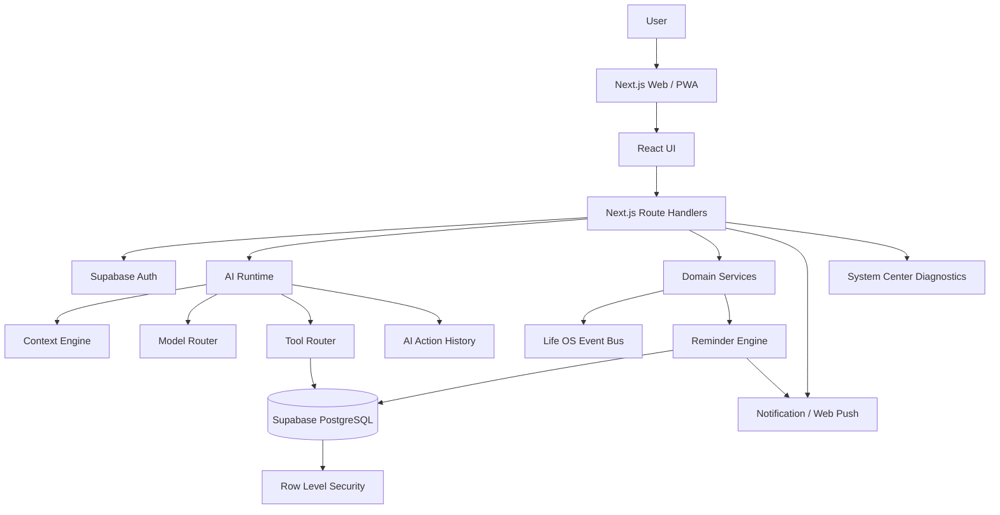

# 🌙 Licia 2.0

<p align="center">
  
</p>

<p align="center">
  <strong>Personal Life OS yang menggabungkan AI, produktivitas, pengetahuan, kesehatan, keuangan, dan refleksi dalam satu ruang pribadi.</strong>
</p>

<p align="center">
  
  
  
  
  
</p>

<p align="center"><em>Your life, connected.</em></p>

---

## ✨ Tentang Licia

**Licia 2.0** adalah aplikasi **Personal Life OS** yang dirancang untuk menjadi pusat kendali kehidupan digital pribadi.

Licia bukan hanya chatbot dan bukan sekadar to-do list. Modul-modulnya terhubung sehingga informasi dari satu area dapat menjadi konteks bagi area lain.

```text
Capture
  ↓
Smart Inbox
  ↓
Task / Note / Decision / Learning
  ↓
Project / Goal / Calendar
  ↓
Focus / Habit / Health / Finance
  ↓
Timeline / Analytics / Insights / Review
  ↓
AI Context Engine
  ↓
Rekomendasi atau tindakan nyata
```

Prinsip utama:

> **Data nyata → konteks relevan → tindakan terkontrol → hasil yang dapat ditelusuri.**

---

# 🚀 Fitur Utama

## 🤖 AI Licia

### Chat Licia — `/chat`

Pintu utama AI untuk bertanya, mencari data, merencanakan pekerjaan, dan menjalankan tindakan nyata tanpa perlu memahami struktur database.

Contoh:

```text
"Apa yang harus saya kerjakan hari ini?"

"Tinjau agenda minggu ini dan buatkan task persiapan untuk meeting yang belum punya task."

"Ingatkan saya berangkat jam 11 karena saya harus ke akademik."
```

### Context Engine

Licia memilih konteks berdasarkan kebutuhan. Sistem dapat memakai context modul tertentu, `search_life_os`, `get_life_snapshot`, atau `get_unified_life_snapshot` untuk permintaan lintas modul.

```text
Pertanyaan finance  → Finance context
Pertanyaan agenda   → Calendar + Task context
Pertanyaan luas     → Unified Life Snapshot
Pencarian item      → Search Life OS
```

### AI Tool Calling

AI memiliki tool layer untuk membaca dan memutasi data nyata, termasuk:

- Task, Subtask, Project, Area, Goal, Milestone
- Calendar/Schedule dan Focus/Pomodoro
- Smart Inbox dan Notes
- Habit dan Learning/Skills
- Reading
- Finance, Account, Budget, Subscription
- Health
- Memory dan Vault
- Decision
- Automation
- Reminder
- Pencarian lintas Life OS
- Unified snapshot dan batch operation

### Model Router

Konfigurasi model:

```env
LICIA_AI_MODEL=
LICIA_AI_HEAVY_MODEL=
```

Runtime dapat menggunakan model ringan untuk permintaan biasa dan model berat ketika request lebih kompleks atau membutuhkan kemampuan tambahan, bila model tersebut dikonfigurasi.

### AI Safety

Operasi destruktif dan operasi massal memiliki guardrail. AI diarahkan untuk mencari ID nyata, melakukan operasi yang sesuai, meminta konfirmasi saat diperlukan, dan melaporkan hasil berdasarkan output tool.

---

# 🧭 Modul Life OS

| Modul | Route | Fungsi utama |
|---|---|---|
| 🏠 Beranda | `/dashboard` | Ringkasan lintas Life OS dan jalur cepat ke sumber data |
| ✨ Hari Ini | `/today` | Agenda, task, focus, dan aktivitas hari berjalan |
| ⚡ Life Command | `/command` | Menjalankan tujuan multi-langkah lewat natural language |
| 📥 Capture Studio | `/capture` | Menangkap teks/input sebelum dirapikan |
| 📥 Smart Inbox | `/inbox` | Menampung item mentah dan AI triage |
| ✅ Tugas | `/tasks` | Task, prioritas, deadline, estimasi, project, subtasks |
| 📅 Kalender | `/calendar` | Agenda dan komitmen berbasis waktu |
| 🧠 Weekly Planner | `/planner` | Menyusun rencana mingguan berbasis data nyata |
| ⏱️ Focus | `/focus` | Sesi kerja terukur yang dapat terhubung ke task |
| 🍅 Pomodoro | `/pomodoro` | Sesi Pomodoro dan histori fokus |
| 📁 Projects | `/projects` | Wadah pekerjaan multi-langkah |
| 🎯 Goals | `/goals` | Target, progress, milestone, next step, review cycle |
| 🗒️ Notes | `/notes` | Catatan pribadi dan sumber context |
| 📚 Reading | `/reading` | Bacaan, progress, sesi, rating, notes, takeaways |
| 🔁 Habits | `/habits` | Rutinitas dan check-in berulang |
| 🎓 Learning | `/learning` | Skill tracker dan hubungan dengan Focus/Goal |
| 🧠 Memory | `/memory` | Informasi yang sengaja disimpan untuk context jangka panjang |
| 🔐 Vault | `/vault` | Knowledge base pribadi untuk note, link, dokumen, tag |
| 💰 Finance | `/finance` | Account, income, expense, budget, saldo, arus kas |
| 🔁 Subscriptions | `/subscriptions` | Billing berulang dan reminder renewals |
| ❤️ Health | `/health` | Log kesehatan dan ringkasan kondisi |
| 🗺️ Life Map | `/life-map` | Hubungan Area → Goal → Project → Task → Calendar/Focus |
| 🕸️ Life Graph | `/life-graph` | Graph Goal, Project, Task dan orphan signal |
| 🕒 Timeline | `/timeline` | Audit pribadi berbasis aktivitas dan perubahan |
| 📊 Analytics | `/analytics` | Pola task, focus, finance, reading, movement, goal, project |
| 💡 Insights | `/insights` | Insight berbasis data nyata |
| 🌊 Life Pulse | `/pulse` | Snapshot cepat kondisi Life OS |
| 📝 Decisions | `/decisions` | Jurnal proses dan hasil pengambilan keputusan |
| 📰 Brief & Review | `/brief` | Ringkasan dan review hari/minggu |
| ⚙️ Automations | `/automations` | Trigger → condition → action → result |
| 🔔 Reminders | `/reminders` | Reminder custom, task-bound, schedule-bound, retry |
| 🧠 AI Action Log | `/ai-history` | Audit operasi AI, batch, dan undo |
| 🔎 Search | `/search` | Pencarian lintas data Life OS |
| 🩺 System Center | `/system` | Diagnosis database, AI, push, reminder, telemetry |
| 📖 Guide | `/guide` | Panduan penggunaan setiap workflow |
| ⚙️ Settings | `/settings` | Tema, font, AI, workspace, notifikasi, PWA, data |

---

# 🔔 Reminder & Notification Engine

Reminder Licia dirancang sebagai data yang persistent, bukan hanya timer browser.

### Kapabilitas

- Custom reminder
- Reminder berbasis task
- Reminder berbasis agenda
- Default reminder agenda
- Retry reminder gagal
- Recovery untuk status `processing` yang macet
- Dedupe sebelum push delivery
- Histori event pada `notification_events`
- Push subscription management
- Dispatcher server dan worker heartbeat

### Arsitektur

```text
Task / Calendar
       ↓
 Reminder Engine
       ↓
notification_events
       ↓
Browser Notification / Web Push
       ↓
Delivery telemetry
```

Production menyediakan worker:

```text
licia-reminder-worker
```

atau dispatcher cron melalui:

```text
scripts/reminder-cron.mjs
```

> Jangan menjalankan dua dispatcher production yang sama secara bersamaan.

---

# 📱 PWA & Offline

Licia dapat dipasang sebagai **Progressive Web App** dan memiliki fondasi offline.

Komponen:

- `public/manifest.webmanifest`
- `public/sw.js`
- `public/offline.html`
- icon 192×192
- icon 512×512
- PWA registration
- offline capture queue

Saat offline, Capture dapat menyimpan input secara lokal dan memproses antrean ketika koneksi kembali tersedia.

---

# 🎨 UI / UX

Licia dirancang untuk desktop dan mobile.

### Pengaturan tampilan

- Light / Dark mode
- Accent presets
- Background presets
- **Pilihan font**
- Density
- Text scale

### Mobile

- Bottom navigation
- Quick Search mobile
- Overlay/sheet viewport-aware
- Mobile account action
- Responsive cards dan grid
- Touch target yang aman

### Motion & device

- Page animation
- Motion intensity
- Reduced motion
- Haptic feedback
- Sound feedback
- Browser notifications
- Offline capture

---

# 💾 Backup, Export & Undo

## Data Export

Pengguna dapat membuat arsip HTML yang mudah dibaca dan dicetak menjadi PDF.

## Backup JSON

Backup API membuat data terstruktur dari tabel yang diizinkan.

## Restore Merge

Restore menggunakan pola merge:

- ID yang sama di-upsert
- `user_id` dipaksa mengikuti user authenticated
- data yang tidak ada di backup tidak ikut dihapus
- payload dibatasi
- jalur restore tetap melalui pemeriksaan security

## AI Action History

`/ai-history` mencatat operasi AI yang benar-benar dijalankan:

- create/update/delete
- tool
- tabel
- jumlah record
- batch ID
- waktu
- status undo

Aksi yang memiliki snapshot dapat dipulihkan melalui Undo.

---

# 🔐 Security & Privacy

## Supabase RLS

Schema menggunakan **Row Level Security** sehingga data pengguna dibatasi pada akun yang terautentikasi sesuai policy.

## Server-side service role

Operasi tertentu membutuhkan:

```env
SUPABASE_SERVICE_ROLE_KEY=...
```

Key ini hanya untuk server.

**Jangan pernah:**

- memakai prefix `NEXT_PUBLIC_` untuk service role,
- menaruhnya di frontend,
- commit ke Git,
- memasukkannya ke ZIP publik,
- menampilkannya pada screenshot/log.

## AI Privacy

Context Engine mengambil data sesuai kebutuhan. Pengaturan AI juga menyediakan kontrol untuk akses konteks lintas Life OS, auto-link, proactive suggestion, dan konfirmasi aksi.

## Memory Privacy

Memory ditujukan untuk informasi yang memang ingin disimpan jangka panjang, bukan otomatis menyimpan seluruh percakapan.

---

# 🏗️ Arsitektur



## Layer kode

```text
app/                 Presentation + routes
app/api/             Server/API routes
components/          Reusable UI
lib/ai/              Context, prompt, runtime, tools, routing
lib/domain/          Domain lifecycle
lib/events/          Life OS event bus
lib/reminders/       Scheduling logic
lib/notifications/   Delivery logic
lib/pwa/             Offline queue
lib/supabase/        Client/server/admin access
supabase/            Database schema & migrations
scripts/             Build, audit, verify, test, worker
```

---

# 🗃️ Database Domain

Baseline database mencakup domain seperti:

```text
users
accounts
expenses
incomes
budgets

tasks
subtasks
projects
areas
goals
goal_milestones
schedule_blocks
pomodoro_sessions

daily_plans
brain_dump_notes
smart_inbox_items
journal_entries

habits
habit_checkins
skills
reading_logs
reading_sessions

health_metrics
hydration_logs
caffeine_logs
meal_logs
medication_logs
fatigue_logs
sleep_logs
movement_logs

subscriptions
social_relations
social_interactions

decisions
user_memories
automations
vault_items

ai_function_call_logs
ai_action_history
ai_pending_actions
ai_usage_events
life_os_events

reminders
notification_events
push_subscriptions
system_health_heartbeats
```

Schema bootstrap V30:

```text
supabase/schema_all_v30.sql
```

Core intelligence migration:

```text
supabase/schema_v30_core_intelligence.sql
```

> Terapkan migration sesuai kondisi database. Jangan menjalankan semua file phase secara membabi buta pada database production yang sudah memiliki data.

---

# 🧰 Tech Stack

| Teknologi | Versi / Peran |
|---|---|
| Next.js | 16.3.6 |
| React | 19.2.8 |
| TypeScript | 5.9.x |
| Supabase JS | 2.117.1 |
| Supabase SSR | 0.12.7 |
| OpenAI SDK | 4.67.3 |
| Tailwind CSS | 3.4.17 |
| Web Push | 3.6.7 |
| Lucide React | UI icons |
| ESLint | 9.35.0 |
| Node.js | 22.x |
| npm | 10+ |

Project menetapkan engine:

```text
Node >=22 <23
npm >=10
```

---

# 📦 Instalasi

## 1. Install dependency

```bash
npm install
```

## 2. Preflight development

```bash
npm run preflight:dev
```

## 3. Verification

```bash
npm run verify
npm run audit
npm run test
```

## 4. Jalankan development

```bash
npm run dev
```

Buka:

```text
http://localhost:3000
```

---

# 🔐 Environment Variables

Buat:

```text
.env.local
```

Minimal:

```env
NEXT_PUBLIC_SUPABASE_URL=https://YOUR_PROJECT.supabase.co
NEXT_PUBLIC_SUPABASE_ANON_KEY=YOUR_PUBLIC_KEY
SUPABASE_SERVICE_ROLE_KEY=YOUR_SERVICE_ROLE_KEY
OPENAI_API_KEY=YOUR_OPENAI_API_KEY
```

Untuk production / Web Push:

```env
NEXT_PUBLIC_SITE_URL=https://example.com
APP_URL=https://example.com
LICIA_URL=https://example.com
LICIA_INTERNAL_URL=https://example.com

LICIA_AI_MODEL=
LICIA_AI_HEAVY_MODEL=

VAPID_SUBJECT=mailto:admin@example.com
VAPID_PUBLIC_KEY=YOUR_VAPID_PUBLIC_KEY
VAPID_PRIVATE_KEY=YOUR_VAPID_PRIVATE_KEY

LICIA_CRON_SECRET=YOUR_CRON_SECRET
LICIA_REMINDER_WORKER_INTERVAL_MS=60000

DEV_TUNNEL_ORIGIN=
```

| Variable | Fungsi |
|---|---|
| `NEXT_PUBLIC_SUPABASE_URL` | URL Supabase |
| `NEXT_PUBLIC_SUPABASE_ANON_KEY` | Public/anon key |
| `SUPABASE_SERVICE_ROLE_KEY` | Akses admin server-side |
| `OPENAI_API_KEY` | AI runtime |
| `LICIA_AI_MODEL` | Model utama eksplisit |
| `LICIA_AI_HEAVY_MODEL` | Model berat opsional |
| `VAPID_SUBJECT` | Identitas Web Push |
| `VAPID_PUBLIC_KEY` | Public VAPID |
| `VAPID_PRIVATE_KEY` | Private VAPID |
| `LICIA_CRON_SECRET` | Secret dispatcher |
| `LICIA_REMINDER_WORKER_INTERVAL_MS` | Interval worker |
| `NEXT_PUBLIC_SITE_URL` | URL publik |
| `APP_URL` | URL server-side |

Jika muncul:

```text
Supabase service-role belum dikonfigurasi di server.
```

pastikan `SUPABASE_SERVICE_ROLE_KEY` ada di environment server dan restart aplikasi.

---

# 🗄️ Setup Supabase

1. Buat project Supabase.
2. Salin URL dan public key ke `.env.local`.
3. Terapkan schema sesuai baseline database.
4. Pastikan RLS dan policy aktif.
5. Konfigurasikan Auth provider yang digunakan.
6. Masukkan service role key hanya ke environment server.

Schema utama:

```text
supabase/schema_all_v30.sql
supabase/schema_v30_core_intelligence.sql
```

---

# 🔔 Setup Web Push

Generate VAPID:

```bash
npx web-push generate-vapid-keys
```

Isi:

```env
VAPID_SUBJECT=mailto:admin@example.com
VAPID_PUBLIC_KEY=...
VAPID_PRIVATE_KEY=...
```

Lalu:

1. Login.
2. Buka **Pengaturan**.
3. Aktifkan browser notification / push.
4. Beri izin notification pada browser.
5. Jalankan test push.
6. Cek `/system`.

Production Web Push membutuhkan HTTPS, service worker, subscription perangkat, VAPID, dan dispatcher yang benar.

---

# ⏰ Reminder Production

Dua mekanisme yang tersedia:

### PM2 Worker

```text
scripts/reminder-worker.mjs
ecosystem.config.cjs
```

### Cron

```text
scripts/reminder-cron.mjs
```

Gunakan **satu jalur dispatcher** untuk job yang sama agar tidak terjadi duplicate processing.

---

# 🏭 Production Build

```bash
npm ci
npm run preflight
npm run verify
npm run audit
npm run test
npm run build
```

Jalankan:

```bash
npm run start
```

atau PM2:

```bash
pm2 start ecosystem.config.cjs
pm2 save
```

Panduan VPS tambahan tersedia di:

```text
DEPLOY_VPS.md
```

---

# 🩺 System Center

Route: `/system`

System Center memantau:

- database health,
- schema V30,
- reminder worker heartbeat,
- overdue/stuck/orphan reminder,
- notification events,
- push devices/subscriptions,
- service worker,
- browser online state,
- AI usage telemetry.

Gunakan halaman ini setelah deployment, migration, atau perubahan environment.

---

# 🧪 Quality Assurance

Script yang tersedia:

```bash
npm run preflight
npm run preflight:dev
npm run verify
npm run audit
npm run test
npm run typecheck
npm run health
npm run build
```

`verify`, `audit`, dan `test` adalah bagian penting dari validasi sebelum deploy.

---

# 🔌 API Utama

```text
/api/chat
/api/ai/batch
/api/ai/undo
/api/intelligence
/api/intelligence/context

/api/weekly-planner
/api/search
/api/activity
/api/inbox/triage

/api/reminders/dispatch
/api/reminders/test
/api/reminders/sync-defaults

/api/notifications
/api/push/subscribe
/api/push/test
/api/push/vapid-public

/api/calendar/ics
/api/backup
/api/export-data
/api/health
/api/system/diagnostics
/api/automations/evaluate
/api/estimate-nutrition
/api/onboarding
```

---

# 🔄 Contoh Workflow

## Ide → Task

```text
Capture
  ↓
Smart Inbox
  ↓
AI triage
  ↓
Task
  ↓
Project / Goal
  ↓
Calendar
  ↓
Focus
```

## Agenda → Task

```text
get_schedule
   ↓
create_task_from_schedule
   ↓
Task baru
   ↓
update_schedule_block
   ↓
agenda terhubung ke task
```

## Agenda → Reminder

```text
Calendar
  ↓
create_schedule_reminder
  ↓
Reminder Center
  ↓
notification_events
  ↓
Browser / Web Push
```

## AI Action → Undo

```text
User request
    ↓
Context
    ↓
Tool selection
    ↓
Confirmation
    ↓
Database mutation
    ↓
AI Action History
    ↓
Undo jika snapshot tersedia
```

---

# 🛡️ Production Checklist

```text
[ ] Node 22.x tersedia
[ ] npm dependency terpasang
[ ] Supabase URL benar
[ ] Supabase anon key benar
[ ] Service role tersedia di server
[ ] OpenAI API key tersedia
[ ] Database schema siap
[ ] RLS aktif
[ ] HTTPS aktif
[ ] VAPID siap jika memakai Web Push
[ ] Reminder dispatcher hanya satu jalur
[ ] npm run preflight lulus
[ ] npm run verify lulus
[ ] npm run audit lulus
[ ] npm run test lulus
[ ] npm run build lulus
[ ] System Center menunjukkan service penting OK
```

---

# 🗺️ Evolusi Arsitektur

Licia 2.0 merupakan hasil evolusi beberapa milestone internal:

```text
V20  → UI polish & stabilization
V21  → Auth / mobile improvements
V22  → Build fixes
V23  → Platform upgrade
V24  → UI + AI refresh
V25  → Information-first UI
V27  → Full Life OS overhaul
V28  → Intelligence + reminder + Web Push
V29  → Dashboard + Reminder + System Center
V30  → Context Engine + AI routing + reliability + observability
```

**Licia 2.0** adalah nama produk/dokumentasi.

**V30** adalah baseline engineering terbaru yang menjadi fondasi implementasi ini.

---

# 📚 Dokumentasi Internal

Repository menyimpan catatan engineering berikut:

```text
V20_POLISH_NOTES.md
V20_RELEASE_NOTES.md
V21_BATCH5_AUTH_MOBILE_FIXES.md
V22.2_BUILD_FIX_NOTES.md
V23.1_BUILD_FIX.md
V23_MAJOR_UPGRADE.md
V24.1_UI_REFRESH_NOTES.md
V24.2_MAJOR_UI_AI_REFRESH.md
V25_UI_REFRESH_NOTES.md
V27_FULL_OVERHAUL_NOTES.md
V28_FULL_INTELLIGENCE_NOTES.md
V29_DASHBOARD_REMINDER_SYSTEM_NOTES.md
V30_RELEASE_NOTES.md
```

Dokumen tersebut adalah histori engineering; README ini menjadi dokumentasi produk dan operasional utama.

---

# 🐛 Troubleshooting

### `Supabase service-role belum dikonfigurasi di server.`

Tambahkan:

```env
SUPABASE_SERVICE_ROLE_KEY=...
```

ke environment server lalu restart.

### Build TypeScript gagal

```bash
npm run typecheck
```

Periksa file dan line yang dilaporkan sebelum menjalankan build lagi.

### Build CSS gagal

Periksa selector CSS/Tailwind yang memakai karakter khusus dan jalankan kembali:

```bash
npm run build
```

### Web Push tidak terkirim

Periksa rantai:

```text
System Center
↓
Push server
↓
Push subscription
↓
Service Worker
↓
Reminder worker / dispatcher
```

### Reminder berhenti saat browser ditutup

Pastikan worker/cron server berjalan. Browser polling bukan pengganti dispatcher production.

---

# 🤝 Pengembangan

Prinsip engineering Licia:

- pertahankan TypeScript strictness,
- jaga RLS dan isolasi user,
- jangan expose service-role credential,
- jangan membuat AI mengklaim data tanpa verifikasi tool,
- pertahankan audit trail untuk mutasi AI yang relevan,
- pertahankan timezone-aware date handling,
- uji mobile layout untuk route baru,
- jalankan verification sebelum production deployment.

---

# 📜 Lisensi

Project saat ini dikonfigurasi sebagai private package:

```json
"private": true
```

Tambahkan lisensi open-source terpisah apabila project nantinya akan dipublikasikan secara open-source.

---

# 🌙 Penutup

Licia 2.0 dirancang sebagai satu tempat untuk:

```text
🧠 Berpikir
📝 Mencatat
✅ Mengerjakan
📅 Menjadwalkan
🎯 Mencapai target
📚 Belajar
❤️ Menjaga kesehatan
💰 Mengelola keuangan
🔔 Mengingat
📊 Melihat pola
🤖 Meminta bantuan AI
🔐 Menjaga data
```

**Licia adalah Personal Life OS yang menghubungkan konteks, data, tindakan, dan refleksi dalam satu sistem.**

<p align="center"><strong>🌙 Licia 2.0 — Your life, connected.</strong></p>
