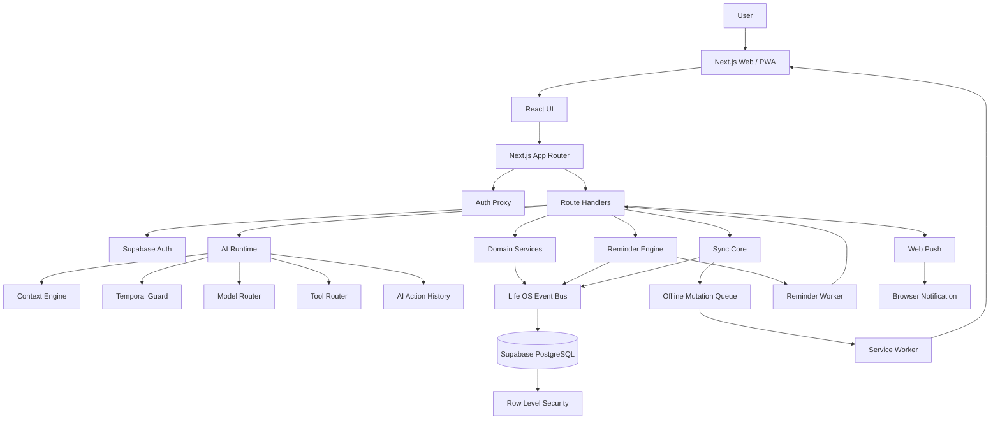

<div align="center">


# 🌙 Licia 3.0

### Personal Life OS — AI, Planning, Memory, Sync & Automation

**Licia 3.0** adalah Personal Life Operating System berbasis web/PWA yang menyatukan tugas, kalender, proyek, tujuan, catatan, kebiasaan, pembelajaran, kesehatan, keuangan, pengingat, sinkronisasi multi-perangkat, dan AI dalam satu workspace yang terhubung.

<p>
  
  
  
  
  
  
</p>

<p>
  <strong>Product:</strong> Licia 3.0 &nbsp;•&nbsp;
  <strong>Engineering baseline:</strong> v0.49.4 &nbsp;•&nbsp;
  <strong>Runtime:</strong> Node.js 22.x
</p>

</div>

---

## ✨ Apa Itu Licia 3.0?

Licia 3.0 bukan sekadar aplikasi to-do list atau chatbot.

Licia dirancang sebagai **Life OS**: sebuah lapisan yang menghubungkan informasi, waktu, pekerjaan, tujuan, kebiasaan, keputusan, dan tindakan sehingga pengguna dapat melihat hubungan antarbagian hidupnya tanpa harus berpindah-pindah sistem.

```text
                     ┌─────────────────────┐
                     │      👤 USER        │
                     └──────────┬──────────┘
                                │
                         Natural Language
                                │
                     ┌──────────▼──────────┐
                     │     🤖 LICIA AI      │
                     │ Context + Tools      │
                     │ Temporal Guard        │
                     │ Model Router          │
                     └──────────┬──────────┘
                                │
        ┌───────────────────────┼───────────────────────┐
        │                       │                       │
   ┌────▼────┐             ┌────▼─────┐           ┌─────▼─────┐
   │ Planning │             │ Life Data │           │ Automation │
   │ & Tasks  │             │ & Memory  │           │ & Reminder │
   └────┬────┘             └────┬─────┘           └─────┬─────┘
        │                       │                       │
        └───────────────────────┼───────────────────────┘
                                │
                       ┌────────▼────────┐
                       │ Supabase / RLS  │
                       │ PostgreSQL      │
                       └────────┬────────┘
                                │
                   ┌────────────┴────────────┐
                   │                         │
             📱 Offline / PWA          💻 Multi-device
             Sync Queue                Conflict Center
```

---

# 🚀 Fitur Utama

## 🤖 AI Life Assistant

Licia dapat bekerja dengan data Life OS melalui **tool calling**, bukan sekadar menghasilkan teks.

Kemampuan utama:

- Natural-language command
- Membaca data pengguna melalui tool
- Membuat, memperbarui, dan menghapus data sesuai tool yang tersedia
- Task assistance
- Calendar assistance
- Planning dan weekly planning
- Finance assistance
- Reminder management
- Inbox triage
- Search lintas domain
- AI action history
- Batch actions
- Undo untuk operasi yang memiliki snapshot
- Proactive insights
- Context-aware responses
- Vision untuk workflow tertentu
- Temporal/date validation
- Model routing berdasarkan kompleksitas permintaan

### AI Context Engine

Context Engine menyusun konteks yang relevan dari data pengguna, termasuk:

- Task yang belum selesai
- Task terlambat
- Task berprioritas tinggi
- Agenda mendatang
- Benturan jadwal
- Project yang stagnan
- Project dengan deadline dekat
- Goal yang berisiko
- Reminder gagal
- Reminder yang stuck
- Masalah delivery notification

Konteks tersebut digunakan untuk membantu AI memahami **keadaan aktual Life OS**, bukan hanya isi pesan terakhir.

---

# 🧠 Temporal Intelligence

Salah satu bagian penting Licia 3.0 adalah perlakuan khusus terhadap tanggal dan waktu.

Untuk permintaan seperti:

```text
"Tampilkan jadwal hari Sabtu tanggal 26."
```

Licia tidak seharusnya hanya mengandalkan interpretasi bahasa model.

Pipeline temporal menggunakan:

```text
User Request
     ↓
Temporal Intent Detection
     ↓
Natural Date Resolution
     ↓
Weekday / Date Validation
     ↓
Timezone Context
     ↓
Calendar Tool
     ↓
Verified Result
```

Temporal Guard dapat:

- mengenali `hari ini`, `besok`, `lusa`, dan tanggal eksplisit,
- mengenali nama hari,
- menggunakan timezone pengguna,
- mencocokkan tanggal dengan weekday,
- mendeteksi pasangan hari/tanggal yang tidak valid,
- memaksa penggunaan engine tanggal deterministik sebelum membaca/mengubah kalender.

Tujuannya adalah mengurangi kesalahan interpretasi tanggal yang umum terjadi pada aplikasi berbasis AI.

---

# 🗂️ Life OS Workspace

Licia 3.0 mengorganisasi kehidupan pengguna ke dalam domain yang saling terhubung.

| Domain | Route | Fungsi |
|---|---|---|
| 🏠 Dashboard | `/dashboard` | Ringkasan Life OS |
| 💬 Chat | `/chat` | Interaksi utama dengan Licia |
| ⚡ Command | `/command` | Command Center |
| 📥 Capture | `/capture` | Quick capture |
| 📥 Inbox | `/inbox` | Smart Inbox dan triage |
| ✅ Tasks | `/tasks` | Task management |
| 📅 Calendar | `/calendar` | Agenda dan schedule |
| 🧭 Planner | `/planner` | Weekly planning |
| 🎯 Goals | `/goals` | Goal dan milestone |
| 📁 Projects | `/projects` | Project management |
| 🧩 Goals & Projects | `/goals-projects` | Workspace gabungan |
| ⏱️ Focus | `/focus` | Focus sessions |
| 🍅 Pomodoro | `/pomodoro` | Pomodoro |
| 📝 Notes | `/notes` | Catatan |
| 🧠 Memory | `/memory` | Long-term user memory |
| 🔐 Vault | `/vault` | Knowledge base |
| 📚 Reading | `/reading` | Reading tracker |
| 🎓 Learning | `/learning` | Skill & learning tracker |
| 🔁 Habits | `/habits` | Habit tracking |
| ❤️ Health | `/health` | Health & wellbeing data |
| 🌿 Wellbeing | `/wellbeing` | Workspace kesehatan & rutinitas |
| 💰 Finance | `/finance` | Keuangan pribadi |
| 🔁 Subscriptions | `/subscriptions` | Subscription & renewal |
| 🤝 Relations | `/relations` | Social relations |
| 🧭 Life Map | `/life-map` | Relationship map antar-domain |
| 🕸️ Life Graph | `/life-graph` | Entity graph |
| 🕒 Timeline | `/timeline` | Activity timeline |
| 📊 Analytics | `/analytics` | Analytics |
| 💡 Insights | `/insights` | Data-driven insights |
| 🌊 Pulse | `/pulse` | Life Pulse snapshot |
| 📝 Decisions | `/decisions` | Decision journal |
| 📖 Brief | `/brief` | Daily/weekly brief |
| 🔄 Review | `/review` | Review workflow |
| ⚙️ Automations | `/automations` | Trigger → condition → action |
| 🔔 Reminders | `/reminders` | Reminder center |
| 🔄 Sync | `/sync` | Device & sync management |
| 🧾 AI History | `/ai-history` | AI mutation audit |
| 🔎 Search | `/search` | Universal search |
| 🩺 System | `/system` | Diagnostics & health |
| 📖 Guide | `/guide` | User guide |
| ⚙️ Settings | `/settings` | Configuration |

> Navigasi desktop dan mobile menggunakan struktur workspace canonical yang sama. Route detail tetap dapat dibuka langsung dari kartu, pencarian, dashboard, dan internal links.

---

# 🔗 Connected Life OS

Kekuatan Licia bukan hanya jumlah fitur, tetapi hubungan antar-domain.

Contoh hubungan:

```text
Goal
 │
 ├── Project
 │     │
 │     ├── Task
 │     │     └── Focus Session
 │     │
 │     └── Calendar Block
 │
 └── Milestone
```

Workflow yang lebih lengkap:

```text
Capture
  ↓
Smart Inbox
  ↓
AI Triage
  ↓
Task
  ↓
Project
  ↓
Goal
  ↓
Calendar
  ↓
Focus
  ↓
Review
  ↓
Insight
```

Dengan pendekatan tersebut, sebuah task tidak harus menjadi data yang berdiri sendiri.

---

# 🔔 Reminder & Notification Engine

Reminder Licia disimpan sebagai **persistent data**, bukan sekadar timer yang hidup di browser.

### Kapabilitas

- Custom reminder
- Reminder berbasis task
- Reminder berbasis calendar/schedule
- Reminder berbasis goal
- Reminder berbasis project
- Reminder berbasis subscription
- Reminder berbasis habit
- Default reminder
- Retry delivery
- Recovery untuk status `processing` yang macet
- Dedupe delivery
- Notification event history
- Push subscription management
- Worker heartbeat
- Delivery telemetry
- Bulk reminder operations
- Konfirmasi deterministic untuk penghapusan semua reminder

### Lifecycle

```text
Task / Calendar / Goal / Project
              │
              ▼
       Reminder Engine
              │
              ▼
         reminders
              │
              ▼
     notification_events
              │
       ┌──────┴──────┐
       ▼             ▼
 Browser Push    Web Push
       │             │
       └──────┬──────┘
              ▼
       Delivery Telemetry
```

### Production Worker

```text
scripts/reminder-worker.mjs
```

Worker memanggil:

```text
/api/reminders/dispatch
```

dengan secret internal:

```text
x-licia-cron-secret
```

Default interval:

```text
60 detik
```

Interval dapat diubah melalui:

```env
LICIA_REMINDER_WORKER_INTERVAL_MS=60000
```

Alternatif fallback tersedia:

```text
scripts/reminder-cron.mjs
```

**Jangan menjalankan PM2 worker dan cron fallback secara bersamaan untuk dispatcher yang sama.**

---

# 🔄 Offline-First & Multi-Device Sync

Licia 3.0 memiliki Sync Core untuk perangkat yang dapat kehilangan koneksi atau melakukan perubahan secara bersamaan.

### Mekanisme

```text
User Mutation
     ↓
Sync Client
     │
     ├── Online ──→ /api/sync/mutation
     │
     └── Offline ─→ Local Queue
                         │
                         ▼
                    Reconnect
                         │
                         ▼
                    Replay Queue
                         │
                         ▼
                  Server Mutation
```

Setiap mutation dapat memiliki:

- `mutationId`
- `deviceId`
- `entityType`
- `operation`
- `entityId`
- `baseVersion`
- `clientUpdatedAt`
- `payload`
- `conflictStrategy`

### Conflict Strategy

Licia menyediakan strategi:

```text
server
latest
manual
smart
```

Strategi `smart` dapat menggunakan `changed_fields` untuk membedakan perubahan pada field yang sama dengan perubahan pada field berbeda.

Jika konflik tidak dapat diselesaikan dengan aman:

```text
Mutation
   ↓
Conflict
   ↓
Conflict Center
   ↓
Manual Resolution
```

### Sync Reliability

Fondasi Sync Core mencakup:

- Device registry
- Mutation idempotency
- Event cursor
- Versioning
- Tombstone delete events
- Offline replay
- Conflict detection
- Conflict resolution
- History-gap detection
- Realtime invalidation
- Sync status UI
- Device-aware synchronization

---

# 📱 PWA & Offline Capture

Licia dapat dipasang sebagai Progressive Web App.

Komponen utama:

```text
public/manifest.webmanifest
public/sw.js
public/offline.html
public/icon-192.png
public/icon-512.png
components/PWARegister.tsx
```

### PWA capabilities

- Installable
- Offline shell
- Offline capture queue
- Service worker
- Push notification
- Reconnect/replay
- Responsive mobile UI

Service worker tidak menangkap Next.js RSC/navigation requests secara sembarangan, sehingga navigasi aplikasi tetap dapat menggunakan pipeline Next.js dengan benar.

---

# 🎨 UI / UX System

Licia 3.0 dirancang untuk desktop dan mobile.

### Visual system

- Light / Dark mode
- Accent presets
- Background presets
- Font selection
- Density
- Text scale
- Responsive cards
- Responsive grids
- Bottom navigation
- Bottom sheet
- Quick Search
- Global Quick Capture
- Toast / dialog system
- Animated numbers
- Page transitions
- Success states
- Reduced motion
- Motion intensity
- Haptic feedback
- Voice Capture

### Mobile-first interaction

```text
Desktop
┌──────────────────────────────────────┐
│ Sidebar │ Workspace                  │
│         │                            │
│         │                            │
└──────────────────────────────────────┘

Mobile
┌──────────────────┐
│     Workspace    │
│                  │
│                  │
├──────────────────┤
│ Home Chat ...    │
└──────────────────┘
```

Menu `Lainnya` digunakan untuk membuka katalog workspace yang tidak ditempatkan pada bottom navigation utama.

---

# 💾 Backup, Export & Recovery

Licia menyediakan beberapa jalur pengelolaan data.

### Backup

```text
/api/backup
```

Menghasilkan data terstruktur yang dapat digunakan untuk recovery.

### Export

```text
/api/export-data
```

Mendukung export data pengguna ke format yang dapat diproses kembali.

### AI Action History

Route:

```text
/ai-history
```

Mencatat operasi AI yang benar-benar dieksekusi, termasuk informasi seperti:

- action
- tool
- entity/table
- jumlah record
- batch
- timestamp
- status
- snapshot yang tersedia untuk undo

### Undo

```text
AI Request
   ↓
Tool Execution
   ↓
Mutation
   ↓
Action History
   ↓
Snapshot
   ↓
Undo
```

Tidak semua operasi dapat di-undo; hanya operasi yang memiliki informasi/snapshot yang diperlukan.

---

# 🔐 Security & Privacy

Security merupakan bagian dari arsitektur, bukan fitur tambahan.

## Supabase Auth

Route aplikasi dilindungi melalui server-side auth check pada `proxy.ts`.

Route authenticated mencakup workspace utama seperti:

```text
/dashboard
/chat
/tasks
/calendar
/goals
/projects
/finance
/health
/settings
/system
...
```

Pengguna yang belum terautentikasi diarahkan ke:

```text
/login
```

## Row Level Security

Database menggunakan Supabase PostgreSQL dan RLS untuk isolasi data antar-user.

Konsep sederhananya:

```text
Authenticated User
        │
        ▼
     Supabase
        │
        ▼
      RLS
        │
        ▼
Only user's permitted rows
```

## Service Role

`SUPABASE_SERVICE_ROLE_KEY` hanya boleh berada di server.

**Jangan:**

- memberi prefix `NEXT_PUBLIC_`,
- menaruhnya di client bundle,
- commit ke Git,
- memasukkannya ke ZIP publik,
- menampilkannya di log,
- menaruhnya di screenshot.

## Security Headers

`next.config.js` mengatur header seperti:

- `X-Content-Type-Options`
- `X-Frame-Options`
- `Referrer-Policy`
- `Permissions-Policy`
- `X-DNS-Prefetch-Control`
- `Cross-Origin-Opener-Policy`
- HSTS ketika production menggunakan HTTPS

---

# 🏗️ Arsitektur Teknis


```mermaid
flowchart TD
    U[User] --> PWA[Next.js Web / PWA]

    PWA --> UI[React UI]
    UI --> ROUTES[Next.js App Router]
    ROUTES --> PROXY[Auth Proxy]
    ROUTES --> API[Route Handlers]

    API --> AUTH[Supabase Auth]
    API --> DOMAIN[Domain Services]
    API --> AI[AI Runtime]
    API --> REM[Reminder Engine]
    API --> PUSH[Web Push]
    API --> SYNC[Sync Core]

    AI --> CONTEXT[Context Engine]
    AI --> TEMP[Temporal Guard]
    AI --> ROUTER[Model Router]
    AI --> TOOLS[Tool Router]
    AI --> HISTORY[AI Action History]

    DOMAIN --> EVENTS[Life OS Event Bus]
    REM --> EVENTS
    SYNC --> EVENTS

    EVENTS --> DB[(Supabase PostgreSQL)]
    DB --> RLS[Row Level Security]

    SYNC --> QUEUE[Offline Mutation Queue]
    QUEUE --> SW[Service Worker]
    SW --> PWA

    REM --> WORKER[Reminder Worker]
    WORKER --> API
    PUSH --> BROWSER[Browser Notification]
```

---

# 🧩 Struktur Source Code

```text
Licia/
│
├── app/
│   ├── (app)/                 # Workspace authenticated
│   ├── (auth)/                # Login / signup
│   ├── api/                   # Server API / route handlers
│   └── page.tsx               # Root entry
│
├── components/
│   ├── auth/
│   ├── chat/
│   ├── dashboard/
│   ├── intelligence/
│   ├── layout/
│   ├── plan/
│   ├── settings/
│   ├── sync/
│   ├── ui/
│   └── v36/
│
├── lib/
│   ├── ai/
│   │   ├── context.ts
│   │   ├── contextEngine.ts
│   │   ├── contextCache.ts
│   │   ├── conversationIntelligence.ts
│   │   ├── modelRouter.ts
│   │   ├── runtime.ts
│   │   ├── systemPrompt.ts
│   │   ├── temporalGuard.ts
│   │   ├── toolRouting.ts
│   │   ├── tools.ts
│   │   └── ...
│   │
│   ├── domain/
│   │   └── reminderLifecycle.ts
│   │
│   ├── events/
│   │   └── bus.ts
│   │
│   ├── notifications/
│   ├── reminders/
│   ├── sync/
│   ├── pwa/
│   ├── supabase/
│   └── ...
│
├── public/
│   ├── manifest.webmanifest
│   ├── sw.js
│   ├── offline.html
│   ├── licia-avatar.png
│   ├── icon-192.png
│   └── icon-512.png
│
├── scripts/
│   ├── build.mjs
│   ├── preflight.mjs
│   ├── verify-v49.mjs
│   ├── test-v49.mjs
│   ├── audit.mjs
│   ├── healthcheck.mjs
│   ├── setup-push.mjs
│   ├── reminder-worker.mjs
│   ├── reminder-cron.mjs
│   └── ...
│
├── supabase/
│   ├── schema_v30_core_intelligence.sql
│   ├── schema_v31_sync.sql
│   ├── schema_v32_sync_experience.sql
│   ├── schema_v33_life_os.sql
│   ├── schema_v34_sync_robustness.sql
│   ├── schema_v35_*.sql
│   ├── schema_v36_intelligence.sql
│   ├── schema_v37_unified_workspaces.sql
│   ├── schema_v38_ai_feedback.sql
│   └── ...
│
├── deploy/
│   └── nginx-licia.conf
│
├── ecosystem.config.cjs
├── next.config.js
├── proxy.ts
├── package.json
├── package-lock.json
├── tsconfig.json
└── tailwind.config.ts
```

---

# 🗄️ Data Model

Baseline schema yang terdeteksi pada source saat ini mencakup domain berikut:

### Core Life OS

```text
users
areas
tasks
subtasks
projects
goals
goal_milestones
schedule_blocks
daily_plans
brain_dump_notes
smart_inbox_items
journal_entries
```

### Productivity

```text
pomodoro_sessions
habits
habit_checkins
skills
reading_logs
reading_sessions
decisions
vault_items
user_memories
automations
```

### Finance

```text
accounts
account_transfers
expenses
incomes
budgets
subscriptions
```

### Health & Wellbeing

```text
health_metrics
hydration_logs
caffeine_logs
meal_logs
medication_logs
fatigue_logs
sleep_logs
movement_logs
```

### Intelligence & AI

```text
ai_function_call_logs
ai_action_history
ai_action_plans
ai_pending_actions
ai_usage_events
ai_insight_feedback
ai_watchers
ai_what_if_runs
life_os_daily_snapshots
```

### Sync & Life Graph

```text
life_os_events
life_os_entity_links
life_os_saved_views
life_os_task_dependencies
life_os_sync_devices
life_os_sync_events
life_os_sync_mutations
life_os_sync_conflicts
```

### Notifications

```text
reminders
notification_events
push_subscriptions
system_health_heartbeats
```

### Optional / Integrated Data

```text
social_relations
social_interactions
anime_watchlist
jikan_cache
```

> Migration files adalah histori evolusi schema. Pada production database yang sudah berisi data, terapkan migration sesuai urutan dan kondisi database. Jangan menjalankan seluruh file SQL secara acak.

---

# 🧰 Tech Stack

| Layer | Teknologi |
|---|---|
| Framework | Next.js 16.3.6 |
| UI | React 19.2.8 |
| Language | TypeScript 5.9.x |
| Styling | Tailwind CSS 3.4.17 |
| Icons | Lucide React |
| Database | Supabase PostgreSQL |
| Auth | Supabase Auth + `@supabase/ssr` |
| AI | OpenAI SDK |
| Push | `web-push` |
| PWA | Service Worker + Web App Manifest |
| Process Manager | PM2 |
| Reverse Proxy | Nginx |
| Runtime | Node.js 22.x |
| Package Manager | npm 10+ |
| Lint | ESLint 9.x |

### Runtime constraint

`package.json` menetapkan:

```json
{
  "engines": {
    "node": ">=22 <23",
    "npm": ">=10"
  }
}
```

Project juga menyediakan:

```text
.nvmrc → 22
```

---

# 📦 Instalasi Lokal

## 1. Clone / extract project

```bash
cd Licia
```

## 2. Gunakan Node.js 22

Dengan NVM:

```bash
nvm use
```

Atau pastikan:

```bash
node -v
npm -v
```

Node harus berada pada major version `22`.

## 3. Install dependency

```bash
npm install
```

Untuk deployment reproducible dengan lockfile:

```bash
npm ci
```

---

# 🔐 Environment Variables

Buat file:

```text
.env.local
```

Contoh konfigurasi:

```env
# Supabase
NEXT_PUBLIC_SUPABASE_URL=https://YOUR_PROJECT.supabase.co
NEXT_PUBLIC_SUPABASE_ANON_KEY=YOUR_PUBLIC_OR_ANON_KEY
SUPABASE_SERVICE_ROLE_KEY=YOUR_SERVER_ONLY_SERVICE_ROLE_KEY

# AI
OPENAI_API_KEY=YOUR_OPENAI_API_KEY
LICIA_AI_MODEL=
LICIA_AI_HEAVY_MODEL=

# Public application URL
NEXT_PUBLIC_SITE_URL=https://example.com
APP_URL=https://example.com

# Internal worker URL
LICIA_INTERNAL_URL=http://127.0.0.1:3000

# Web Push
VAPID_SUBJECT=mailto:admin@example.com
VAPID_PUBLIC_KEY=
VAPID_PRIVATE_KEY=

# Reminder dispatcher
LICIA_CRON_SECRET=
LICIA_REMINDER_WORKER_INTERVAL_MS=60000
```

### Variabel penting

| Variable | Scope | Fungsi |
|---|---|---|
| `NEXT_PUBLIC_SUPABASE_URL` | Client/Server | URL project Supabase |
| `NEXT_PUBLIC_SUPABASE_ANON_KEY` | Client/Server | Public Supabase key |
| `SUPABASE_SERVICE_ROLE_KEY` | **Server only** | Operasi privileged |
| `OPENAI_API_KEY` | **Server only** | AI API |
| `LICIA_AI_MODEL` | Server | Model utama eksplisit |
| `LICIA_AI_HEAVY_MODEL` | Server | Model untuk workload kompleks |
| `NEXT_PUBLIC_SITE_URL` | Public | Origin aplikasi |
| `APP_URL` | Server | Base URL server |
| `LICIA_INTERNAL_URL` | Server | URL internal worker |
| `VAPID_SUBJECT` | Server | Identitas Web Push |
| `VAPID_PUBLIC_KEY` | Public/Server | Public VAPID |
| `VAPID_PRIVATE_KEY` | **Server only** | Private VAPID |
| `LICIA_CRON_SECRET` | **Server only** | Auth dispatcher |
| `LICIA_REMINDER_WORKER_INTERVAL_MS` | Server | Interval worker |

**Jangan commit `.env.local`.**

---

# 🗃️ Setup Supabase

1. Buat project PostgreSQL di Supabase.
2. Ambil URL dan public key.
3. Simpan credential pada `.env.local`.
4. Terapkan migration/schema sesuai baseline database.
5. Pastikan RLS aktif.
6. Konfigurasikan Auth provider yang diperlukan.
7. Simpan service role key hanya di environment server.

Migration utama untuk arsitektur modern mencakup:

```text
supabase/schema_v30_core_intelligence.sql
supabase/schema_v31_sync.sql
supabase/schema_v32_sync_experience.sql
supabase/schema_v33_life_os.sql
supabase/schema_v34_sync_robustness.sql
...
```

Untuk deployment existing database, ikuti urutan migration yang sesuai dengan state database. Repository juga menyediakan file schema gabungan tertentu, tetapi migration incremental tetap perlu diperlakukan sebagai perubahan schema, bukan file yang aman untuk dieksekusi berulang tanpa pemeriksaan.

---

# 🧪 Development Workflow

### Preflight

```bash
npm run preflight:dev
```

### Development server

```bash
npm run dev
```

Buka:

```text
http://localhost:3000
```

### Type checking

```bash
npm run typecheck
```

### Lint

```bash
npm run lint
```

### Verification

```bash
npm run verify
```

### Audit

```bash
npm run audit
```

### Tests

```bash
npm run test
```

### Health check

```bash
npm run health
```

### Production preflight

```bash
npm run preflight
```

### Production build

```bash
npm run build
```

### Production server

```bash
npm run start
```

---

# 🧪 Quality Gate

Sebelum production deployment:

```bash
npm run preflight
npm run typecheck
npm run verify
npm run audit
npm run test
npm run build
```

Jika semua lolos:

```text
Preflight     ✓
TypeScript    ✓
Verification  ✓
Audit         ✓
Tests         ✓
Build         ✓
```

---

# 🔔 Setup Web Push

Generate VAPID keys:

```bash
npx web-push generate-vapid-keys
```

Atau gunakan helper repository:

```bash
npm run setup:push
```

Masukkan hasilnya:

```env
VAPID_SUBJECT=mailto:admin@example.com
VAPID_PUBLIC_KEY=...
VAPID_PRIVATE_KEY=...
```

Kemudian:

1. Jalankan aplikasi melalui HTTPS pada production.
2. Login.
3. Buka Settings.
4. Aktifkan Push Notification.
5. Izinkan notifikasi browser.
6. Jalankan test push.
7. Periksa `/system`.

---

# ⏰ Production Reminder Worker

PM2 menjalankan dua process utama:

```text
licia
licia-reminder-worker
```

Start:

```bash
pm2 start ecosystem.config.cjs
pm2 save
```

Cek:

```bash
pm2 status
```

Log worker:

```bash
pm2 logs licia-reminder-worker --lines 100
```

Worker membutuhkan:

```env
LICIA_INTERNAL_URL=http://127.0.0.1:3000
LICIA_CRON_SECRET=YOUR_SECRET
LICIA_REMINDER_WORKER_INTERVAL_MS=60000
```

Worker akan melakukan request ke:

```text
POST /api/reminders/dispatch
```

dengan header internal:

```text
x-licia-cron-secret
```

### Fallback Cron

Jika PM2 worker tidak digunakan, tersedia:

```bash
node scripts/reminder-cron.mjs
```

**Pilih satu mekanisme dispatcher. Jangan menjalankan keduanya untuk job yang sama.**

---

# 🏭 Deployment VPS

Repository menyediakan:

```text
DEPLOY_VPS.md
deploy/nginx-licia.conf
ecosystem.config.cjs
```

Baseline production:

```text
Ubuntu 22.04 / 24.04
        │
        ├── Node.js 22
        ├── npm 10+
        ├── PM2
        ├── Nginx
        ├── HTTPS
        └── Supabase
```

Contoh alur deployment:

```bash
npm ci

npm run preflight
npm run verify
npm run audit
npm run test
npm run build

pm2 start ecosystem.config.cjs
pm2 save
```

Nginx diarahkan ke:

```text
127.0.0.1:3000
```

Health endpoint:

```text
/api/health
```

Local:

```bash
curl http://127.0.0.1:3000/api/health
```

Production:

```bash
curl https://example.com/api/health
```

Untuk detail deployment VPS, gunakan `DEPLOY_VPS.md`.

---

# 🩺 System Center

Route:

```text
/system
```

System Center adalah pusat diagnosis Licia.

Area yang dapat diperiksa meliputi:

```text
Database
Supabase schema
Reminder worker
Reminder delivery
Notification events
Push subscriptions
Service Worker
Browser connectivity
Sync devices
Sync events
Sync mutations
Conflicts
AI usage telemetry
```

Gunakan `/system` setelah:

- deployment,
- migration,
- konfigurasi Web Push,
- perubahan environment,
- restart worker,
- masalah reminder,
- masalah sync.

---

# 🔌 API Surface

Licia menggunakan Next.js Route Handlers.

### AI

```text
/api/chat
/api/ai/batch
/api/ai/history
/api/ai/undo
/api/intelligence
/api/intelligence/context
/api/intelligence/daily-snapshot
```

### Planning

```text
/api/weekly-planner
/api/v36/plan
/api/v38/daily-plan
/api/v38/daily-review
/api/proactive/evaluate
```

### Tasks

```text
/api/tasks/assist
```

### Search

```text
/api/search
/api/v36/search
```

### Sync

```text
/api/sync/status
/api/sync/pull
/api/sync/mutation
/api/sync/resolve
/api/sync/conflicts
/api/sync/register-device
/api/sync/preferences
```

### Reminders

```text
/api/reminders/dispatch
/api/reminders/test
/api/reminders/sync-defaults
```

### Notifications & Push

```text
/api/notifications
/api/push/vapid-public
/api/push/subscribe
/api/push/test
```

### Data

```text
/api/backup
/api/export-data
/api/calendar/ics
/api/activity
/api/onboarding
```

### System

```text
/api/health
/api/system/diagnostics
```

---

# 🔄 Contoh End-to-End Workflow

## 1. Capture → Task

```text
User
 ↓
Quick Capture
 ↓
Smart Inbox
 ↓
AI Triage
 ↓
Task
 ↓
Project / Goal
```

## 2. Task → Calendar

```text
Task
 ↓
Schedule
 ↓
Calendar Block
 ↓
Reminder
 ↓
Push Notification
```

## 3. Calendar → Task

```text
Calendar Event
 ↓
Create Task
 ↓
Linked Task
 ↓
Focus
```

## 4. Goal → Project → Task

```text
Goal
 ↓
Milestone
 ↓
Project
 ↓
Task
 ↓
Calendar
 ↓
Focus
 ↓
Review
```

## 5. AI Mutation

```text
Natural Language
       ↓
Temporal / Context Guard
       ↓
Context Engine
       ↓
Model Router
       ↓
Tool Router
       ↓
Confirmation when required
       ↓
Database Mutation
       ↓
AI Action History
       ↓
Undo (when supported)
```

---

# 🧠 AI Architecture

```text
                    User Message
                         │
                         ▼
               Conversation Intelligence
                         │
             ┌───────────┴───────────┐
             ▼                       ▼
       Temporal Guard          Context Engine
             │                       │
             └───────────┬───────────┘
                         ▼
                    Model Router
                         │
                         ▼
                    AI Runtime
                         │
                         ▼
                    Tool Router
                         │
             ┌───────────┼───────────┐
             ▼           ▼           ▼
           Read        Write       Search
             │           │           │
             └───────────┼───────────┘
                         ▼
                    Supabase/RLS
                         │
                         ▼
                   Action History
```

### Model Routing

Model router dapat mempertimbangkan:

- panjang prompt,
- image/vision,
- kompleksitas bahasa,
- domain yang terlibat,
- operasi kalender,
- operasi mutasi,
- jumlah domain yang perlu dipahami.

Environment:

```env
LICIA_AI_MODEL=
LICIA_AI_HEAVY_MODEL=
```

Jika model heavy tidak dikonfigurasi, fallback runtime menggunakan model default yang telah ditentukan source.

---

# 🛡️ Reliability Engineering

Licia 3.0 memasukkan beberapa mekanisme reliability pada jalur AI dan data.

### AI Request Lifecycle

OpenAI retry memperhatikan `AbortSignal`.

Jika browser membatalkan request:

```text
Browser Abort
    ↓
AbortSignal
    ↓
AI retry dihentikan
    ↓
Recovery mutation tidak diteruskan
```

Retry tetap digunakan untuk error yang sesuai, seperti kondisi transient/server-side yang dapat diulang.

### Reminder Reliability

Reminder memiliki status dan telemetry yang memungkinkan deteksi:

```text
pending
waiting_for_device
processing
failed
cancelled
```

Sistem dapat mendeteksi:

- overdue reminder,
- stuck processing,
- delivery failure,
- missing device,
- notification delivery issue.

### Bound Reminder Lifecycle

Reminder yang terikat pada entity tertentu dapat dibatalkan ketika target berubah atau dihapus, termasuk:

```text
task
schedule
goal
project
subscription
habit
```

---

# 📊 Observability

Licia menyediakan beberapa lapisan observability:

```text
Health API
   ↓
System Center
   ↓
Worker Heartbeat
   ↓
Notification Telemetry
   ↓
AI Usage Events
   ↓
AI Action History
   ↓
Life OS Events
```

Ini membantu membedakan masalah:

```text
UI problem
vs
API problem
vs
Database problem
vs
AI problem
vs
Reminder worker problem
vs
Push delivery problem
vs
Sync conflict
```

---

# 📋 Production Checklist

```text
[ ] Node.js 22.x
[ ] npm 10+
[ ] package-lock.json tersedia
[ ] Supabase URL benar
[ ] Supabase public key benar
[ ] Service role hanya di server
[ ] OpenAI API key hanya di server
[ ] Database migrations sesuai baseline
[ ] RLS aktif
[ ] HTTPS aktif
[ ] VAPID configured jika memakai Web Push
[ ] LICIA_CRON_SECRET configured
[ ] Reminder worker aktif
[ ] Hanya satu dispatcher reminder aktif
[ ] Sync Core migration aktif
[ ] PM2 process sehat
[ ] Nginx sehat
[ ] /api/health OK
[ ] /system menunjukkan service penting OK
[ ] npm run preflight lulus
[ ] npm run typecheck lulus
[ ] npm run verify lulus
[ ] npm run audit lulus
[ ] npm run test lulus
[ ] npm run build lulus
```

---

# 🐛 Troubleshooting

## `Supabase service-role belum dikonfigurasi`

Pastikan:

```env
SUPABASE_SERVICE_ROLE_KEY=...
```

tersedia pada **server environment**, lalu restart process.

---

## Reminder tidak terkirim

Periksa:

```text
/system
```

Kemudian:

```bash
pm2 status
pm2 logs licia-reminder-worker --lines 100
```

Pastikan:

```env
LICIA_INTERNAL_URL=http://127.0.0.1:3000
LICIA_CRON_SECRET=...
```

benar.

Jika reminder berstatus `waiting_for_device`, periksa Push Subscription perangkat.

Jika `failed`, periksa error delivery dan jadwalkan ulang jika diperlukan.

---

## Push Notification tidak bekerja

Periksa urutan:

```text
HTTPS
 ↓
Service Worker
 ↓
Browser Permission
 ↓
Push Subscription
 ↓
VAPID
 ↓
Reminder Dispatcher
 ↓
Web Push
```

Pastikan production menggunakan HTTPS dan subscription perangkat masih aktif.

---

## Sync stuck / conflict

Buka:

```text
/sync
```

Periksa:

- device,
- queue,
- conflict,
- mutation status,
- last sync.

Kemudian gunakan Conflict Center untuk konflik yang membutuhkan resolusi manual.

---

## AI memberikan tanggal yang salah

Untuk masalah tanggal/weekday:

1. Periksa timezone.
2. Periksa tanggal referensi.
3. Periksa temporal context.
4. Pastikan calendar tool digunakan.
5. Periksa hasil Temporal Guard.
6. Jangan mengandalkan jawaban model tanpa data calendar untuk pertanyaan jadwal.

---

## Build gagal

Jalankan secara berurutan:

```bash
npm run preflight
npm run typecheck
npm run verify
npm run audit
npm run test
npm run build
```

Perbaiki error pertama yang muncul sebelum melanjutkan ke tahap berikutnya.

---

# 🧭 Engineering Principles

Licia 3.0 dibangun dengan beberapa prinsip:

### 1. Data sebelum asumsi

Jika jawaban membutuhkan data pengguna, AI harus menggunakan data/tool yang relevan.

### 2. Deterministic untuk hal yang deterministic

Tanggal, status, ID, dan mutation tidak seharusnya bergantung pada tebakan model.

### 3. Server authoritative

Offline queue boleh menerima perubahan sementara, tetapi server tetap menjadi sumber kebenaran untuk sinkronisasi.

### 4. Auditability

Operasi AI yang melakukan mutation perlu dapat dilacak.

### 5. Privacy by default

Credential server dan data user tidak boleh masuk ke client secara tidak perlu.

### 6. Mobile is a first-class surface

Fitur baru harus tetap usable pada viewport kecil.

### 7. Graceful failure

Jika AI, push, sync, atau network gagal, aplikasi harus memberikan status yang dapat dipahami dan jalur recovery.

---

# 📁 Dokumentasi Engineering

Repository menyimpan histori upgrade dan hardening.

Dokumen penting:

```text
V30_RELEASE_NOTES.md
V31_RELEASE_NOTES.md
V32_RELEASE_NOTES.md
V33_UPGRADE.md
V34_UPGRADE.md
V34_AI_UPGRADE.md
V35_COMPLETE_UPGRADE.md
V36_UPGRADE.md
V37_UPGRADE_GUIDE.md
V38_UPGRADE.md
V40_UI_UX_CONSOLIDATION.md
V41_UI_NAV_CHAT_FINANCE_TASKS.md
V42_CONSOLIDATED_UX.md
V43_UX_TASKS_FINANCE_GUIDE.md
V48_UPGRADE.md
V49_2_RUNTIME_FIX.md
V49_3_NAVIGATION_RUNTIME_FIX.md
V49_4_REMINDER_BULK_FIX.md
DEPLOY_VPS.md
QA_CHECKLIST.md
```

README ini adalah dokumentasi utama produk dan engineering saat ini; dokumen versi digunakan sebagai changelog dan catatan implementasi.

---

# 🗺️ Evolusi Licia

```text
Early Licia
    │
    ▼
Productivity App
    │
    ▼
Life OS
    │
    ├── AI Context
    ├── Planning
    ├── Reminders
    ├── Web Push
    ├── Offline Queue
    ├── Multi-device Sync
    ├── Conflict Resolution
    ├── Finance
    ├── Health
    ├── Knowledge
    ├── Analytics
    └── Proactive Intelligence
             │
             ▼
        ╔═══════════╗
        ║ LICIA 3.0 ║
        ╚═══════════╝
```

**Licia 3.0** adalah positioning produk generasi baru di atas codebase engineering yang saat ini berada pada baseline **v0.49.4**.

---

# 📌 Current Baseline

| Item | Current |
|---|---|
| Product generation | **Licia 3.0** |
| Package version | **0.49.4** |
| Next.js | **16.3.6** |
| React | **19.2.8** |
| TypeScript | **5.9.x** |
| Node.js | **22.x** |
| npm | **10+** |
| Database | Supabase PostgreSQL |
| Auth | Supabase Auth |
| AI | OpenAI SDK |
| Push | Web Push / VAPID |
| Sync | Offline-first multi-device |
| PWA | Enabled |
| Process manager | PM2 |
| Reverse proxy | Nginx |

---

# 🔒 Repository Security

Sebelum commit:

```bash
git status
git diff --check
```

Pastikan file sensitif tidak masuk:

```text
.env
.env.local
.env.production
service-role keys
OpenAI keys
VAPID private key
cron secret
database credentials
```

Gunakan `.gitignore` dan environment manager pada deployment.

Jika repository menggunakan GitHub push protection, **jangan mencoba mem-bypass secret scanning**. Hapus credential dari commit dan rotate credential yang sudah pernah terekspos.

---

# 📜 License

Project pada `package.json` saat ini ditandai:

```json
{
  "private": true
}
```

Artinya repository/package belum didefinisikan sebagai package open-source publik melalui metadata tersebut.

Jika Licia akan dirilis sebagai open-source, tambahkan license file dan metadata lisensi secara eksplisit.

---

<div align="center">

## 🌙 Licia 3.0

**Your life. Connected. Contextualized. Actionable.**

```text
Think → Capture → Plan → Act → Remember → Review → Improve
```

Made with TypeScript, Next.js, Supabase, AI, and a lot of engineering.

</div>
