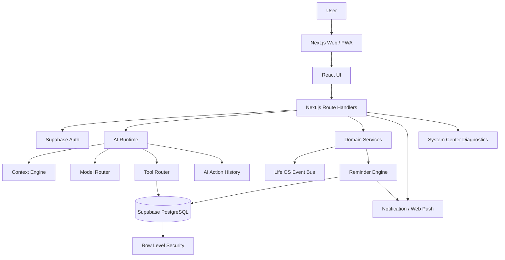

# 🌙 Licia 2.0

<p align="center">
  
</p>

<p align="center">
  <strong>Personal Life OS yang menggabungkan AI, produktivitas, pengetahuan, kesehatan, keuangan, dan refleksi dalam satu ruang pribadi.</strong>
</p>

<p align="center">
  
  
  
  
  
</p>

<p align="center"><em>Your life, connected.</em></p>

---

<p align="center">
  <strong>🧠 AI-native &nbsp;•&nbsp; 🔄 Multi-device sync &nbsp;•&nbsp; 📱 PWA & Android &nbsp;•&nbsp; 💰 Finance ledger &nbsp;•&nbsp; 🔔 Persistent reminders</strong>
</p>

<p align="center">
  <sub>Built with a reliability-first approach: authenticated data, verified mutations, offline recovery, observability, and production-ready workflows.</sub>
</p>

---

## ✨ Tentang Licia

**Licia 2.0** adalah aplikasi **Personal Life OS** yang dirancang untuk menjadi pusat kendali kehidupan digital pribadi.

Licia bukan hanya chatbot dan bukan sekadar to-do list. Modul-modulnya terhubung sehingga informasi dari satu area dapat menjadi konteks bagi area lain.

```text
Capture
  ↓
Smart Inbox
  ↓
Task / Note / Decision / Learning
  ↓
Project / Goal / Calendar
  ↓
Focus / Habit / Health / Finance
  ↓
Timeline / Analytics / Insights / Review
  ↓
AI Context Engine
  ↓
Rekomendasi atau tindakan nyata
```

Prinsip utama:

> **Data nyata → konteks relevan → tindakan terkontrol → hasil yang dapat ditelusuri.**

## 🛡️ AI Reliability & Context Intelligence

Licia memisahkan intent pesan saat ini dari konteks percakapan lama. Sistem mengenali pergantian topik, follow-up, referensi entitas, dan operasi data sebelum memilih konteks serta tool.

Untuk mutation, runtime menerapkan alur `UNDERSTAND → ROUTE → VALIDATE → ACT → VERIFY → RESPOND`. Jawaban sukses diblokir apabila tidak ada mutation terverifikasi. Argumen function tool divalidasi server sebelum `executeTool`, dan target konfirmasi destruktif dapat disimpan sebagai pending action milik user di database.

Riwayat chat dapat dipulihkan dari server melalui tabel `ai_chat_messages`; `localStorage` dipakai sebagai cache UI agar percakapan tetap nyaman ketika offline atau migrasi belum diterapkan.

---

# 🚀 Fitur Utama

## 🤖 AI Licia

### Chat Licia — `/chat`

Pintu utama AI untuk bertanya, mencari data, merencanakan pekerjaan, dan menjalankan tindakan nyata tanpa perlu memahami struktur database.

Contoh:

```text
"Apa yang harus saya kerjakan hari ini?"

"Tinjau agenda minggu ini dan buatkan task persiapan untuk meeting yang belum punya task."

"Ingatkan saya berangkat jam 11 karena saya harus ke akademik."
```

### Context Engine

Licia memilih konteks berdasarkan kebutuhan. Sistem dapat memakai context modul tertentu, `search_life_os`, `get_life_snapshot`, atau `get_unified_life_snapshot` untuk permintaan lintas modul.

```text
Pertanyaan finance  → Finance context
Pertanyaan agenda   → Calendar + Task context
Pertanyaan luas     → Unified Life Snapshot
Pencarian item      → Search Life OS
```

### AI Tool Calling

AI memiliki tool layer untuk membaca dan memutasi data nyata, termasuk:

- Task, Subtask, Project, Area, Goal, Milestone
- Calendar/Schedule dan Focus/Pomodoro
- Smart Inbox dan Notes
- Habit dan Learning/Skills
- Reading
- Finance, Account, Budget, Subscription
- Health
- Memory dan Vault
- Decision
- Automation
- Reminder
- Pencarian lintas Life OS
- Unified snapshot dan batch operation

### Model Router

Model AI default:

```text
gpt-6-luna
```

Untuk mengganti model melalui environment, gunakan `LICIA_AI_MODEL`. Jalur kompleks dapat memakai `LICIA_AI_HEAVY_MODEL`, sedangkan panggilan yang membutuhkan function tools dapat diarahkan ke `LICIA_AI_TOOL_MODEL`. Tanpa konfigurasi tambahan, router menggunakan model utama yang dipilih aplikasi.

### Migrasi database terbaru

Untuk mengaktifkan riwayat chat lintas perangkat, jalankan migration database berikut sekali:

```text
supabase/migrations/0015_ai_chat_history.sql
```

Migration ini aman terhadap data lama karena tabel dibuat dengan `create table if not exists`. Bila belum dijalankan, chat tetap bekerja menggunakan cache riwayat lokal dan fitur pending action lama tetap kompatibel.

### AI Safety

Operasi destruktif dan operasi massal memiliki guardrail. AI diarahkan untuk mencari ID nyata, melakukan operasi yang sesuai, meminta konfirmasi saat diperlukan, dan melaporkan hasil berdasarkan output tool.

---

# 🧭 Modul Life OS

| Modul             | Route            | Fungsi utama                                                 |
| ----------------- | ---------------- | ------------------------------------------------------------ |
| 🏠 Beranda        | `/dashboard`     | Ringkasan lintas Life OS dan jalur cepat ke sumber data      |
| ✨ Hari Ini       | `/today`         | Agenda, task, focus, dan aktivitas hari berjalan             |
| ⚡ Life Command   | `/command`       | Menjalankan tujuan multi-langkah lewat natural language      |
| 📥 Capture Studio | `/capture`       | Menangkap teks/input sebelum dirapikan                       |
| 📥 Smart Inbox    | `/inbox`         | Menampung item mentah dan AI triage                          |
| ✅ Tugas          | `/tasks`         | Task, prioritas, deadline, estimasi, project, subtasks       |
| 📅 Kalender       | `/calendar`      | Agenda dan komitmen berbasis waktu                           |
| 🧠 Weekly Planner | `/planner`       | Menyusun rencana mingguan berbasis data nyata                |
| ⏱️ Focus          | `/focus`         | Sesi kerja terukur yang dapat terhubung ke task              |
| 🍅 Pomodoro       | `/pomodoro`      | Sesi Pomodoro dan histori fokus                              |
| 📁 Projects       | `/projects`      | Wadah pekerjaan multi-langkah                                |
| 🎯 Goals          | `/goals`         | Target, progress, milestone, next step, review cycle         |
| 🗒️ Notes          | `/notes`         | Catatan pribadi dan sumber context                           |
| 📚 Reading        | `/reading`       | Bacaan, progress, sesi, rating, notes, takeaways             |
| 🔁 Habits         | `/habits`        | Rutinitas dan check-in berulang                              |
| 🎓 Learning       | `/learning`      | Skill tracker dan hubungan dengan Focus/Goal                 |
| 🧠 Memory         | `/memory`        | Informasi yang sengaja disimpan untuk context jangka panjang |
| 🔐 Vault          | `/vault`         | Knowledge base pribadi untuk note, link, dokumen, tag        |
| 💰 Finance        | `/finance`       | Account, income, expense, budget, saldo, arus kas            |
| 🔁 Subscriptions  | `/subscriptions` | Billing berulang dan reminder renewals                       |
| ❤️ Health         | `/health`        | Log kesehatan dan ringkasan kondisi                          |
| 🗺️ Life Map       | `/life-map`      | Hubungan Area → Goal → Project → Task → Calendar/Focus       |
| 🕸️ Life Graph     | `/life-graph`    | Graph Goal, Project, Task dan orphan signal                  |
| 🕒 Timeline       | `/timeline`      | Audit pribadi berbasis aktivitas dan perubahan               |
| 📊 Analytics      | `/analytics`     | Pola task, focus, finance, reading, movement, goal, project  |
| 💡 Insights       | `/insights`      | Insight berbasis data nyata                                  |
| 🌊 Life Pulse     | `/pulse`         | Snapshot cepat kondisi Life OS                               |
| 📝 Decisions      | `/decisions`     | Jurnal proses dan hasil pengambilan keputusan                |
| 📰 Brief & Review | `/brief`         | Ringkasan dan review hari/minggu                             |
| ⚙️ Automations    | `/automations`   | Trigger → condition → action → result                        |
| 🔔 Reminders      | `/reminders`     | Reminder custom, task-bound, schedule-bound, retry           |
| 🧠 AI Action Log  | `/ai-history`    | Audit operasi AI, batch, dan undo                            |
| 🔎 Search         | `/search`        | Pencarian lintas data Life OS                                |
| 🩺 System Center  | `/system`        | Diagnosis database, AI, push, reminder, telemetry            |
| 📖 Guide          | `/guide`         | Panduan penggunaan setiap workflow                           |
| ⚙️ Settings       | `/settings`      | Tema, font, AI, workspace, notifikasi, PWA, data             |

---

# 🔔 Reminder & Notification Engine

Reminder Licia dirancang sebagai data yang persistent, bukan hanya timer browser.

### Kapabilitas

- Custom reminder
- Reminder berbasis task
- Reminder berbasis agenda
- Default reminder agenda
- Retry reminder gagal
- Recovery untuk status `processing` yang macet
- Dedupe sebelum push delivery
- Histori event pada `notification_events`
- Push subscription management
- Dispatcher server dan worker heartbeat

### Arsitektur

```text
Task / Calendar
       ↓
 Reminder Engine
       ↓
notification_events
       ↓
Browser Notification / Web Push
       ↓
Delivery telemetry
```

Production menyediakan worker:

```text
licia-reminder-worker
```

atau dispatcher cron melalui:

```text
scripts/reminder-cron.mjs
```

> Jangan menjalankan dua dispatcher production yang sama secara bersamaan.

---

# 📱 PWA & Offline

Licia dapat dipasang sebagai **Progressive Web App** dan memiliki fondasi offline.

Komponen:

- `public/manifest.webmanifest`
- `public/sw.js`
- `public/offline.html`
- icon 192×192
- icon 512×512
- PWA registration
- offline capture queue

Saat offline, Capture dapat menyimpan input secara lokal dan memproses antrean ketika koneksi kembali tersedia.

---

# 🎨 UI / UX

Licia dirancang untuk desktop dan mobile.

### Pengaturan tampilan

- Light / Dark mode
- Accent presets
- Background presets
- **Pilihan font**
- Density
- Text scale

### Mobile

- Bottom navigation
- Quick Search mobile
- Overlay/sheet viewport-aware
- Mobile account action
- Responsive cards dan grid
- Touch target yang aman

### Motion & device

- Page animation
- Motion intensity
- Reduced motion
- Haptic feedback
- Sound feedback
- Browser notifications
- Offline capture

### Smart Capture & pintasan keyboard

- **Simpan Cepat** (`Ctrl/Cmd+Shift+L` atau `n`) mengenali penanda alami saat mode **Tugas**: `besok jam 7 malam`, `jumat`, `3 hari lagi`, `tanggal 20`, `12/10`, `!1`/`p2`/`prioritas rendah`, serta nominal `47k`/`1,5jt`. Hasilnya tampil sebagai chip sebelum disimpan. Logika ada di `lib/text/smartParse.ts` dan berjalan di perangkat.
- **Pintasan**: `g` lalu `d`/`p`/`c`/`t`/`a`/`f`/`g`/`k`/`m`/`w`/`i`/`s`/`/` untuk berpindah halaman; `?` menampilkan daftar lengkap. Definisi ada di `lib/shortcuts.ts`.
- **Aksesibilitas**: skip link, fokus keyboard yang jelas, dan dukungan reduced-motion/forced-colors.
- **Fallback model AI**: isi `LICIA_AI_FALLBACK_MODEL` agar chat tetap menjawab saat model utama overload.

---

# 💾 Backup, Export & Undo

### Bahasa, keterbacaan, dan alur kerja

- **Dwibahasa penuh (ID/EN)** — pilih di Pengaturan, atau `Ctrl/⌘+K` lalu ketik `>bahasa`. Kunci kamus = teks Indonesia apa adanya: `t("Tugas dibuat")` di komponen klien (`useLanguage()`) atau `const { t } = await getServerT()` di komponen server. Tambahkan padanan Inggris di `lib/locales/en.ts`; `npm run i18n:check` menggagalkan CI bila ada teks UI baru tanpa terjemahan. Placeholder memakai `{nama}`: `t("{n} tugas", { n: 3 })`.
- **Palet aksi (`Ctrl/⌘+K`)** — `>` perintah, `/` halaman, `?` cari data; teks bebas menawarkan "Buat tugas: …".
- **Tugas** — tampilan Daftar / Kanban / Matriks Eisenhower / Pekan (seret-lepas atau pilih "Pindahkan ke…"); pintasan `J K X E Enter #`; semua aksi cepat bisa **Diurungkan** (`Ctrl/⌘+Z`).
- **Beranda** — tombol **Atur beranda** (tampil/sembunyi, urutan) dan mode **Hari ini saja**.
- **Overlay** — semua dialog/sheet memakai `components/ui/Overlay.tsx` (perangkap fokus, Esc hanya untuk yang teratas). Lapisan z-index hanya lewat token (`z-nav`, `z-sheet`, `z-modal`, `z-palette`, `z-toast`; lihat `lib/zIndex.ts`).
- **Ukuran teks & kontras** — teks minimum 11 px berbasis rem; Pengaturan > Ukuran teks. Aksen kustom diturunkan otomatis menjadi _isian_ dan _tinta_ yang lolos WCAG AA (`lib/contrast.ts`).

## Data Export

Pengguna dapat membuat arsip HTML yang mudah dibaca dan dicetak menjadi PDF.

## Backup JSON

Backup API membuat data terstruktur dari tabel yang diizinkan.

## Restore Merge

Restore menggunakan pola merge:

- ID yang sama di-upsert
- `user_id` dipaksa mengikuti user authenticated
- data yang tidak ada di backup tidak ikut dihapus
- payload dibatasi
- jalur restore tetap melalui pemeriksaan security

## AI Action History

`/ai-history` mencatat operasi AI yang benar-benar dijalankan:

- create/update/delete
- tool
- tabel
- jumlah record
- batch ID
- waktu
- status undo

Aksi yang memiliki snapshot dapat dipulihkan melalui Undo.

---

# 🔐 Security & Privacy

## Supabase RLS

Schema menggunakan **Row Level Security** sehingga data pengguna dibatasi pada akun yang terautentikasi sesuai policy.

## Server-side service role

Operasi tertentu membutuhkan:

```env
SUPABASE_SERVICE_ROLE_KEY=...
```

Key ini hanya untuk server.

**Jangan pernah:**

- memakai prefix `NEXT_PUBLIC_` untuk service role,
- menaruhnya di frontend,
- commit ke Git,
- memasukkannya ke ZIP publik,
- menampilkannya pada screenshot/log.

## AI Privacy

Context Engine mengambil data sesuai kebutuhan. Pengaturan AI juga menyediakan kontrol untuk akses konteks lintas Life OS, auto-link, proactive suggestion, dan konfirmasi aksi.

## Memory Privacy

Memory ditujukan untuk informasi yang memang ingin disimpan jangka panjang, bukan otomatis menyimpan seluruh percakapan.

---

# 🏗️ Arsitektur


```mermaid
flowchart TD
    U[User] --> PWA[Next.js Web / PWA]
    PWA --> UI[React UI]
    UI --> API[Next.js Route Handlers]

    API --> AUTH[Supabase Auth]
    API --> AI[AI Runtime]
    API --> DOMAIN[Domain Services]
    API --> PUSH[Notification / Web Push]

    AI --> CE[Context Engine]
    AI --> MR[Model Router]
    AI --> TR[Tool Router]
    TR --> DB[(Supabase PostgreSQL)]

    DOMAIN --> EVENTS[Life OS Event Bus]
    DOMAIN --> REM[Reminder Engine]
    REM --> DB
    REM --> PUSH

    DB --> RLS[Row Level Security]
    AI --> LOG[AI Action History]
    API --> SYS[System Center Diagnostics]
```

## Layer kode

```text
app/                 Presentation + routes
app/api/             Server/API routes
components/          Reusable UI
lib/ai/              Context, prompt, runtime, tools, routing
lib/domain/          Domain lifecycle
lib/events/          Life OS event bus
lib/reminders/       Scheduling logic
lib/notifications/   Delivery logic
lib/pwa/             Offline queue
lib/supabase/        Client/server/admin access
supabase/            Database schema & migrations
scripts/             Build, audit, verify, test, worker
```

---

# 🗃️ Database Domain

Baseline database mencakup domain seperti:

```text
users
accounts
expenses
incomes
budgets

tasks
subtasks
projects
areas
goals
goal_milestones
schedule_blocks
pomodoro_sessions

daily_plans
brain_dump_notes
smart_inbox_items
journal_entries

habits
habit_checkins
skills
reading_logs
reading_sessions

health_metrics
hydration_logs
caffeine_logs
meal_logs
medication_logs
fatigue_logs
sleep_logs
movement_logs

subscriptions
social_relations
social_interactions

decisions
user_memories
automations
vault_items

ai_function_call_logs
ai_action_history
ai_pending_actions
ai_usage_events
life_os_events

reminders
notification_events
push_subscriptions
system_health_heartbeats
```

Migration schema kini menggunakan canonical migration chain di supabase/migrations/. Terapkan migration secara berurutan sesuai kondisi database dan jangan mencampur snapshot legacy dengan chain migration production.

---

# 🧰 Tech Stack

| Teknologi    | Versi / Peran |
| ------------ | ------------- |
| Next.js      | 16.4.0        |
| React        | 19.2.8        |
| TypeScript   | 5.9.x         |
| Supabase JS  | 2.117.1       |
| Supabase SSR | 0.12.7        |
| OpenAI SDK   | 4.67.3        |
| Tailwind CSS | 4.3.3         |
| Web Push     | 3.6.7         |
| Lucide React | UI icons      |
| ESLint       | 9.35.0        |
| Node.js      | 22.x          |
| npm          | 10+           |

Project menetapkan engine:

```text
Node >=22 <23
npm >=10
```

---

# 📦 Instalasi

## 1. Install dependency

```bash
npm install
```

## 2. Preflight development

```bash
npm run preflight:dev
```

## 3. Verification

```bash
npm run typecheck
npm run lint
npm run i18n:check
npm run db:verify
npm run verify
npm run audit
npm run test
```

## 4. Jalankan development

```bash
npm run dev
```

Buka:

```text
http://localhost:3000
```

---

# 🔐 Environment Variables

> **Security:** `.env.local` hanya untuk mesin/deployment environment dan tidak boleh di-commit. Jika credential rahasia pernah masuk Git, segera rotate credential tersebut dan hapus secret dari branch aktif.

Buat:

```text
.env.local
```

Minimal:

```env
NEXT_PUBLIC_SUPABASE_URL=https://YOUR_PROJECT.supabase.co
NEXT_PUBLIC_SUPABASE_ANON_KEY=YOUR_PUBLIC_KEY
SUPABASE_SERVICE_ROLE_KEY=YOUR_SERVICE_ROLE_KEY
OPENAI_API_KEY=YOUR_OPENAI_API_KEY
```

Untuk production / Web Push:

```env
NEXT_PUBLIC_SITE_URL=https://example.com
APP_URL=https://example.com
LICIA_URL=https://example.com
LICIA_INTERNAL_URL=https://example.com

LICIA_AI_MODEL=
LICIA_AI_HEAVY_MODEL=

VAPID_SUBJECT=mailto:admin@example.com
VAPID_PUBLIC_KEY=YOUR_VAPID_PUBLIC_KEY
VAPID_PRIVATE_KEY=YOUR_VAPID_PRIVATE_KEY

LICIA_CRON_SECRET=YOUR_CRON_SECRET
LICIA_REMINDER_WORKER_INTERVAL_MS=60000

DEV_TUNNEL_ORIGIN=
```

| Variable                            | Fungsi                  |
| ----------------------------------- | ----------------------- |
| `NEXT_PUBLIC_SUPABASE_URL`          | URL Supabase            |
| `NEXT_PUBLIC_SUPABASE_ANON_KEY`     | Public/anon key         |
| `SUPABASE_SERVICE_ROLE_KEY`         | Akses admin server-side |
| `OPENAI_API_KEY`                    | AI runtime              |
| `LICIA_AI_MODEL`                    | Model utama eksplisit   |
| `LICIA_AI_HEAVY_MODEL`              | Model berat opsional    |
| `VAPID_SUBJECT`                     | Identitas Web Push      |
| `VAPID_PUBLIC_KEY`                  | Public VAPID            |
| `VAPID_PRIVATE_KEY`                 | Private VAPID           |
| `LICIA_CRON_SECRET`                 | Secret dispatcher       |
| `LICIA_REMINDER_WORKER_INTERVAL_MS` | Interval worker         |
| `NEXT_PUBLIC_SITE_URL`              | URL publik              |
| `APP_URL`                           | URL server-side         |

Jika muncul:

```text
Supabase service-role belum dikonfigurasi di server.
```

pastikan `SUPABASE_SERVICE_ROLE_KEY` ada di environment server dan restart aplikasi.

---

# 🗄️ Setup Supabase

1. Buat project Supabase.
2. Salin URL dan public key ke `.env.local`.
3. Terapkan schema sesuai baseline database.
4. Pastikan RLS dan policy aktif.
5. Konfigurasikan Auth provider yang digunakan.
6. Masukkan service role key hanya ke environment server.

Schema utama:

```text
supabase/migrations/
```

---

# 🔔 Setup Web Push

Generate VAPID:

```bash
npx web-push generate-vapid-keys
```

Isi:

```env
VAPID_SUBJECT=mailto:admin@example.com
VAPID_PUBLIC_KEY=...
VAPID_PRIVATE_KEY=...
```

Lalu:

1. Login.
2. Buka **Pengaturan**.
3. Aktifkan browser notification / push.
4. Beri izin notification pada browser.
5. Jalankan test push.
6. Cek `/system`.

Production Web Push membutuhkan HTTPS, service worker, subscription perangkat, VAPID, dan dispatcher yang benar.

---

# ⏰ Reminder Production

Dua mekanisme yang tersedia:

### PM2 Worker

```text
scripts/reminder-worker.mjs
ecosystem.config.cjs
```

### Cron

```text
scripts/reminder-cron.mjs
```

Gunakan **satu jalur dispatcher** untuk job yang sama agar tidak terjadi duplicate processing.

---

# 🏭 Production Build

```bash
npm ci
npm run preflight
npm run verify
npm run audit
npm run test
npm run build
```

Jalankan:

```bash
npm run start
```

atau PM2:

```bash
pm2 start ecosystem.config.cjs
pm2 save
```

Panduan VPS tambahan tersedia di:

```text
DEPLOY_VPS.md
```

---

# 🩺 System Center

Route: `/system`

System Center memantau:

- database health,
- schema ,
- reminder worker heartbeat,
- overdue/stuck/orphan reminder,
- notification events,
- push devices/subscriptions,
- service worker,
- browser online state,
- AI usage telemetry.

Gunakan halaman ini setelah deployment, migration, atau perubahan environment.

---

# 🧪 Quality Assurance

Script yang tersedia:

```bash
npm run preflight
npm run preflight:dev
npm run verify
npm run audit
npm run test
npm run typecheck
npm run health
npm run build
```

`verify`, `audit`, dan `test` adalah bagian penting dari validasi sebelum deploy.

---

# 🔌 API Utama

```text
/api/chat
/api/ai/batch
/api/ai/undo
/api/intelligence
/api/intelligence/context

/api/weekly-planner
/api/search
/api/activity
/api/inbox/triage

/api/reminders/dispatch
/api/reminders/test
/api/reminders/sync-defaults

/api/notifications
/api/push/subscribe
/api/push/test
/api/push/vapid-public

/api/calendar/ics
/api/backup
/api/export-data
/api/health
/api/system/diagnostics
/api/automations/evaluate
/api/estimate-nutrition
/api/onboarding
```

---

# 🔄 Contoh Workflow

## Ide → Task

```text
Capture
  ↓
Smart Inbox
  ↓
AI triage
  ↓
Task
  ↓
Project / Goal
  ↓
Calendar
  ↓
Focus
```

## Agenda → Task

```text
get_schedule
   ↓
create_task_from_schedule
   ↓
Task baru
   ↓
update_schedule_block
   ↓
agenda terhubung ke task
```

## Agenda → Reminder

```text
Calendar
  ↓
create_schedule_reminder
  ↓
Reminder Center
  ↓
notification_events
  ↓
Browser / Web Push
```

## AI Action → Undo

```text
User request
    ↓
Context
    ↓
Tool selection
    ↓
Confirmation
    ↓
Database mutation
    ↓
AI Action History
    ↓
Undo jika snapshot tersedia
```

---

# 🛡️ Production Checklist

```text
[ ] Node 22.x tersedia
[ ] npm dependency terpasang
[ ] Supabase URL benar
[ ] Supabase anon key benar
[ ] Service role tersedia di server
[ ] VAPID subject/public/private tersedia
[ ] LICIA_CRON_SECRET tersedia
[ ] Reminder worker PM2 aktif
[ ] Migration sync sudah diterapkan
[ ] OpenAI API key tersedia
[ ] Database schema siap
[ ] RLS aktif
[ ] HTTPS aktif
[ ] VAPID siap jika memakai Web Push
[ ] Reminder dispatcher hanya satu jalur
[ ] npm run preflight lulus
[ ] npm run verify lulus
[ ] npm run audit lulus
[ ] npm run test lulus
[ ] npm run build lulus
[ ] System Center menunjukkan service penting OK
```

---

# 🧩 Architecture & engineering principles

Licia dibangun sebagai satu sistem yang menghubungkan UI, API, AI, domain service, database, sync, dan notification pipeline.

```text
                         ┌──────────────────────┐
                         │       Licia UI       │
                         │ Web / PWA / Android  │
                         └──────────┬───────────┘
                                    │
                                    ▼
                         ┌──────────────────────┐
                         │     Route / API      │
                         │ auth • validation    │
                         │ mutation • context   │
                         └───────┬──────┬───────┘
                                 │      │
                         ┌───────▼──┐ ┌─▼──────────────┐
                         │ AI Layer │ │ Domain Services│
                         │ context  │ │ finance        │
                         │ routing  │ │ reminders      │
                         │ tools    │ │ sync / events  │
                         └──────┬───┘ └───────┬────────┘
                                │             │
                                └──────┬──────┘
                                       ▼
                              ┌──────────────────┐
                              │ Supabase         │
                              │ Auth + Postgres  │
                              │ RLS + functions  │
                              └───────┬──────────┘
                                      │
                       ┌──────────────┼──────────────┐
                       ▼              ▼              ▼
                    Realtime        Web Push      Audit / Logs
                       │              │
                       └──────┬───────┘
                              ▼
                         Device clients
```

### Lapisan kode

```text
app/                 Presentation, pages, route handlers
components/          Reusable UI dan interaction layer
lib/ai/              Context, prompt, routing, tools, orchestration
lib/domain/          Domain services dan lifecycle
lib/events/          Life OS event bus
lib/reminders/       Reminder scheduling dan recovery
lib/notifications/   Web Push dan delivery telemetry
lib/pwa/             Offline queue dan PWA helpers
lib/supabase/        Client, server, dan admin access
supabase/            Canonical migrations dan database helpers
scripts/             Build, preflight, audit, verification, tests, worker
native/android/      Android WebView shell dan native bridge
deploy/              Reverse proxy / VPS configuration
config/              Application version metadata
```

### Prinsip engineering

- **User-scoped by default** — query dan mutation tetap terikat pada user yang authenticated.
- **Verify before claiming success** — AI tidak boleh menganggap aksi berhasil hanya karena tool dipanggil.
- **Server validates mutations** — payload, ownership, origin, ukuran request, dan mutation state diverifikasi sebelum perubahan data.
- **Idempotent sync** — mutation ID, version, lease, cursor, conflict record, dan replay menjaga sinkronisasi tetap konsisten.
- **Safe financial writes** — transfer memakai server-side transaction path dan account locking.
- **Persistent reminders** — reminder tidak bergantung pada tab browser tetap terbuka.
- **Progressive enhancement** — PWA, offline replay, Realtime, dan native Android menambah kemampuan tanpa menghilangkan jalur dasar web.

---

# 🗄️ Database & migrations

Sumber migration production adalah:

```text
supabase/migrations/
```

Chain canonical saat ini berjalan dari **0001 sampai 0015**.

Migration chain mencakup fondasi aplikasi, sinkronisasi multi-device, finance ledger, mutation lease, distributed rate limiting, dan aggregation helpers.

Gunakan:

```bash
npm run db:verify
```

untuk memeriksa struktur dan urutan migration yang diharapkan.

Untuk database yang sudah berisi data:

> Jangan menjalankan snapshot legacy dan migration chain secara acak. Ikuti urutan canonical dan cek kondisi database target terlebih dahulu.

---

# 📦 Backup, export & recovery

### Backup JSON

Backup menyediakan data terstruktur per user.

Restore memakai mode **merge**, sehingga:

- user_id dipaksa mengikuti user yang authenticated,
- ID yang sama di-upsert,
- data yang tidak terdapat di backup tidak ikut dihapus,
- payload dibatasi,
- kegagalan per tabel dilaporkan.

### Human-readable export

Route /api/export-data menghasilkan arsip HTML yang dapat dibaca, dicetak, atau disimpan menjadi PDF.

### AI Action History

/ai-history menyimpan mutation AI yang benar-benar dijalankan dan menyediakan jejak untuk Undo pada action yang memiliki snapshot yang sesuai.

---

# 📱 Native Android

Source Android tersedia di:

```text
native/android/
```

Shell Android menggunakan WebView untuk terhubung ke instance Licia online dan menyediakan native bridge untuk kebutuhan perangkat.

Fitur native saat ini mencakup:

- deep link ke domain Licia,
- share-to-Capture,
- file chooser,
- kamera,
- haptic feedback,
- back navigation,
- system bar handling,
- offline/error screen,
- Safe Browsing,
- pembatasan third-party cookies,
- mixed-content blocking.

Konfigurasi aplikasi membaca metadata dari:

```text
config/licia-version.json
```

versionName mengikuti appVersion, sedangkan host Android mengikuti LICIA_URL.

Release build menonaktifkan cleartext traffic dan application backup. Debug build dapat mengaktifkan cleartext untuk kebutuhan development.

---

# 🧪 Quality gates

Sebelum production deployment, jalankan:

```bash
npm run preflight
npm run typecheck
npm run lint
npm run i18n:check
npm run db:verify
npm run audit
npm run test
npm run verify:native
npm run build
```

CI GitHub menjalankan quality gates tersebut sebagai automated verification. Sebelum membuka perubahan untuk production, jalankan setidaknya `npm run typecheck`, `npm run lint`, `npm run format:check`, `npm run test`, dan `npm run build`. CI kemudian memeriksa:

- type safety,
- lint,
- unit dan regression checks,
- i18n completeness,
- migration consistency,
- PCF architecture boundaries,
- native project structure,
- dependency/security checks,
- production build.

Health check:

```bash
npm run health
```

Endpoint:

```text
/api/health
```

---

# 🚀 Production deployment

Licia dapat dijalankan melalui Vercel atau VPS.

### Vercel

Project production terhubung ke repository GitHub dan branch main.

Gunakan Node.js 22.x untuk menyamakan runtime dengan:

```text
package.json
.nvmrc
preflight
GitHub CI
```

Environment production minimal:

```text
NEXT_PUBLIC_SUPABASE_URL
NEXT_PUBLIC_SUPABASE_ANON_KEY
SUPABASE_URL
SUPABASE_SERVICE_ROLE_KEY
OPENAI_API_KEY
NEXT_PUBLIC_SITE_URL
APP_URL
LICIA_URL
```

Untuk Web Push dan reminder:

```text
VAPID_SUBJECT
VAPID_PUBLIC_KEY
VAPID_PRIVATE_KEY
LICIA_CRON_SECRET
```

### VPS

Panduan VPS lengkap tersedia di:

```text
DEPLOY_VPS.md
```

PM2 menjalankan dua proses utama:

```text
licia
licia-reminder-worker
```

> Untuk reminder production, gunakan satu dispatcher utama agar event tidak diproses ganda.

---

# 🔐 Environment variables

Gunakan .env.example sebagai referensi.

Variabel utama:

| Variable                             | Fungsi                                         |
| ------------------------------------ | ---------------------------------------------- |
| NEXT_PUBLIC_SUPABASE_URL             | URL Supabase                                   |
| NEXT_PUBLIC_SUPABASE_ANON_KEY        | Public/anon key                                |
| SUPABASE_URL                         | URL server-side                                |
| SUPABASE_SERVICE_ROLE_KEY            | Server-only admin access                       |
| OPENAI_API_KEY                       | AI runtime                                     |
| LICIA_AI_MODEL                       | Model utama                                    |
| LICIA_AI_HEAVY_MODEL                 | Model untuk jalur kompleks                     |
| LICIA_AI_TOOL_MODEL                  | Model untuk tool calling                       |
| LICIA_AI_FALLBACK_MODEL              | Model cadangan                                 |
| LICIA_AI_OMIT_TEMPERATURE            | Compatibility control untuk reasoning model    |
| LICIA_AI_REASONING_EFFORT            | Kontrol reasoning effort                       |
| NEXT_PUBLIC_SITE_URL                 | Public origin                                  |
| APP_URL                              | Server application origin                      |
| LICIA_URL                            | Base URL aplikasi                              |
| LICIA_INTERNAL_URL                   | Internal URL opsional                          |
| VAPID_SUBJECT                        | Identitas Web Push                             |
| VAPID_PUBLIC_KEY                     | Public VAPID key                               |
| VAPID_PRIVATE_KEY                    | Private VAPID key                              |
| LICIA_CRON_SECRET                    | Secret dispatcher                              |
| LICIA_REMINDER_WORKER_INTERVAL_MS    | Interval worker                                |
| LICIA_REMINDER_MAX_DELIVERY_ATTEMPTS | Batas percobaan delivery                       |
| LICIA_REMINDER_MAX_OVERDUE_MS        | Batas keterlambatan reminder                   |
| LICIA_SYNC_DEFAULT_INTERVAL_SECONDS  | Default interval sync                          |
| LICIA_CONTEXT_CACHE_TTL_MS           | Context cache TTL                              |
| LICIA_ALLOW_MISSING_ORIGIN           | Kontrol untuk non-browser client di production |
| LICIA_DEV_ORIGINS                    | Origin development tambahan                    |
| DEV_TUNNEL_ORIGIN                    | Origin tunnel development                      |

### Security rule

Jangan pernah commit secret ke repository.

Khusus:

```text
SUPABASE_SERVICE_ROLE_KEY
OPENAI_API_KEY
VAPID_PRIVATE_KEY
LICIA_CRON_SECRET
```

harus tetap berada di server/deployment environment.

---

# 🩺 System Center

Gunakan /system sebagai dashboard diagnosis setelah deployment atau perubahan konfigurasi.

Area yang dipantau:

```text
Database
AI configuration
Reminder worker
Push subscriptions
Notification events
Sync state
Device registration
Telemetry
Service readiness
```

Untuk sinkronisasi dan konflik, gunakan:

```text
/sync
```

---

# 🐛 Troubleshooting

### Build gagal

```bash
npm run preflight
npm run typecheck
npm run lint
npm run test
npm run build
```

Perbaiki error pertama yang dilaporkan sebelum mengejar error berikutnya.

### Chat tidak berjalan

Periksa:

```text
OPENAI_API_KEY
LICIA_AI_MODEL
LICIA_AI_TOOL_MODEL
LICIA_AI_FALLBACK_MODEL
```

### Reminder tidak terkirim

Periksa:

```text
VAPID_SUBJECT
VAPID_PUBLIC_KEY
VAPID_PRIVATE_KEY
LICIA_CRON_SECRET
licia-reminder-worker
```

Kemudian buka /system.

### Sync antar perangkat tidak masuk

Periksa:

```text
Supabase Auth
RLS / policies
device registration
sync cursor
mutation status
Realtime
```

Kemudian buka /sync.

### Web Push aktif tetapi notifikasi tidak muncul

Periksa permission browser, subscription device, service worker, dan event delivery pada /system.

### Production request mendapat 403

Periksa:

```text
NEXT_PUBLIC_SITE_URL
APP_URL
LICIA_URL
LICIA_ALLOW_MISSING_ORIGIN
```

Pastikan origin production benar dan sesuai konfigurasi deployment.

---

# 📚 Dokumentasi repository

File utama:

```text
README.md
DEPLOY_VPS.md
CHANGELOG.md
.env.example

config/licia-version.json
public/version.json
public/manifest.webmanifest
public/sw.js

supabase/README.md
supabase/migrations/

scripts/preflight.mjs
scripts/audit.mjs
scripts/verify-migrations.mjs
scripts/test-pcf.mjs
scripts/verify-native.mjs
scripts/reminder-worker.mjs
scripts/reminder-cron.mjs

native/android/
deploy/
```

Dokumentasi historis lama tetap dapat berada di repository sebagai referensi engineering, tetapi **README ini adalah pintu utama untuk memahami kondisi Licia saat ini**.

---

# 🌙 Licia

Licia menyatukan:

```text
🧠 Berpikir
📝 Mencatat
✅ Mengerjakan
📅 Menjadwalkan
🎯 Mencapai target
📚 Belajar
❤️ Menjaga kesehatan
💰 Mengelola keuangan
🔔 Mengingat
🔄 Sinkronisasi
📊 Melihat pola
🤖 Bertindak dengan AI
🔐 Menjaga data
```

<p align="center">
  <strong>Licia — Your life, connected.</strong>
</p>
